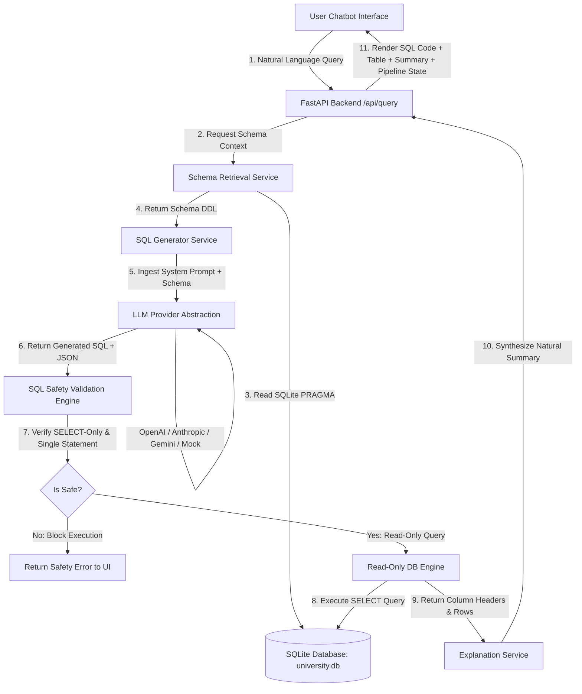
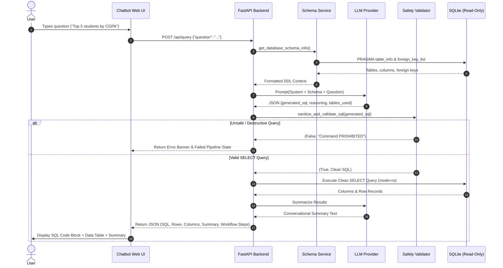
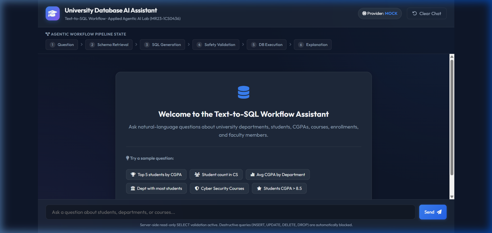
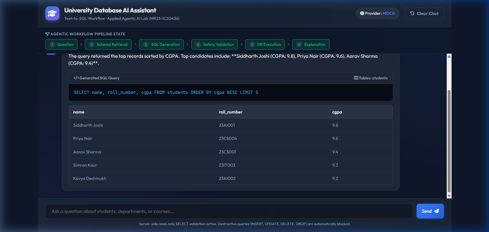
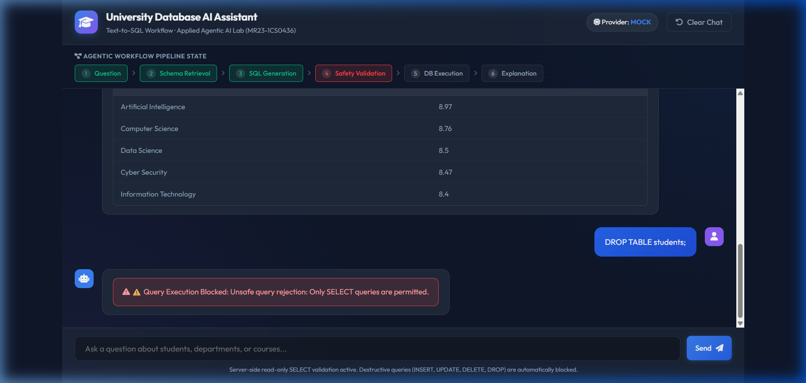

# Experiment 01 — Text-to-SQL Workflow

**Course Code:** MR23-1CS0436
**Course Name:** Applied Agentic AI
**Laboratory:** Applied Agentic AI Laboratory
**Status:** ✅ Completed

---

## 1. Experiment Number
**Experiment 01**

---

## 2. Experiment Title
**University Database AI Assistant — Text-to-SQL Workflow**

---

## 3. Aim
To design, build, and evaluate an end-to-end LLM-powered Text-to-SQL agentic workflow that retrieves database schema context, translates natural language user questions into valid SQLite SELECT queries, applies server-side read-only safety validation, executes queries against a local database, and returns conversational natural-language explanations alongside tabular results.

---

## 4. Problem Statement
Relational databases store critical domain data in structured tables. However, querying these databases requires specialized knowledge of SQL (Structured Query Language), relational database management systems (RDBMS), table aliases, foreign keys, and JOIN conditions. Non-technical users—such as university administrators, academic counselors, or students—cannot interact directly with SQL databases without intermediary software developers.

Attempting to automate SQL generation with standard zero-shot LLM prompts often results in hallucinated table/column names, syntactically invalid queries, or severe security vulnerabilities (e.g., destructive `DROP TABLE` or `DELETE` operations). An agentic Text-to-SQL workflow addresses these challenges by incorporating schema introspection, structured prompt construction, server-side read-only validation, execution, and output explanation.

---

## 5. Objectives
1. **Schema Introspection & Retrieval:** Extract database tables, column definitions, data types, and relational foreign keys dynamically to inject into prompt context.
2. **Structured Prompt Synthesis:** Construct deterministic prompts instructing Large Language Models to generate valid SQLite SELECT queries adhering to target schemas.
3. **Server-Side Safety Validation:** Implement a multi-layered security engine that enforces SELECT-only execution, blocks destructive commands (`INSERT`, `UPDATE`, `DELETE`, `DROP`, `ALTER`), and rejects multi-statement SQL injection attempts.
4. **Interactive Chatbot Interface:** Build a web application featuring a live 6-step agentic workflow visualizer, sample question chips, code block formatting, and responsive data tables.
5. **Provider Abstraction & Offline Capability:** Design a decoupled LLM service supporting external API providers (OpenAI, Anthropic, Gemini) alongside an offline pattern-matching provider (`MockLLMProvider`) for zero-config lab evaluation.
6. **Automated Testing:** Implement unit and integration tests covering health checks, schema introspection, safety validation, and query execution.

---

## 6. Theory / Concept
Text-to-SQL represents a specialized form of **Semantic Parsing & Structured Translation**. It converts unstructured human intention into precise formal logic executable by a database runtime engine.

Key underlying AI principles include:
* **In-Context Schema Injection:** Providing the model with structural domain definitions prior to reasoning.
* **Deterministic Output Formatting:** Enforcing structured JSON responses containing generated SQL, reasoning summaries, and table references.
* **Guardrailed Execution Loops:** Validating AI outputs against formal rules before executing side effects on external database systems.

---

## 7. What is Text-to-SQL?
Text-to-SQL is an AI pipeline that translates natural language text (e.g., *"Show the top 5 students based on CGPA"*) into a structured query language statement (`SELECT name, roll_number, cgpa FROM students ORDER BY cgpa DESC LIMIT 5;`).

By bridging human language and relational algebra, Text-to-SQL democratizes data access, enabling natural conversational data exploration over complex relational enterprise databases.

---

## 8. Role of Large Language Models (LLMs)
Large Language Models act as the reasoning engine in Text-to-SQL pipelines:
* **Syntactic Understanding:** Parsing linguistic nuance, implicit aggregations (e.g., *"most enrolled"* $\rightarrow$ `COUNT(...) ORDER BY ... DESC`), and logical conditions.
* **Relational Mapping:** Mapping natural vocabulary (e.g., *"profs"*, *"courses"*, *"marks"*) to canonical schema entities (`faculty`, `courses`, `cgpa`).
* **Query Synthesis:** Generating syntactically valid SQL code respecting target dialect constraints (SQLite functions like `strftime` and `ROUND`).
* **Result Explanation:** Translating raw database tuples back into coherent conversational summaries for end users.

---

## 9. Role of Schema Retrieval
Directly asking an LLM to generate SQL without schema context leads to severe hallucinations (e.g., querying non-existent columns like `students.gpa` instead of `students.cgpa`).

The schema retrieval step dynamically inspects:
1. **Table Names:** Identifies available relational entities (`departments`, `students`, `courses`, `enrollments`, `faculty`).
2. **Column Attributes:** Extracts field names, data types, and primary key indicators.
3. **Foreign Key Mapping:** Discovers relational joins (e.g., `students.department_id -> departments.id`).

Providing this retrieved schema context grounds the LLM, reducing column hallucination rates to near zero.

---

## 10. System Architecture



---

## 11. Detailed Workflow Sequence



---

## 12. Technology Stack
* **Programming Language:** Python 3.10+
* **Backend Framework:** FastAPI, Uvicorn
* **Database & ORM:** SQLite 3, SQLAlchemy 2.0
* **API & Validation:** Pydantic v2, Pydantic-Settings
* **Frontend UI:** HTML5, Vanilla CSS3 (Glassmorphism), Vanilla JavaScript, FontAwesome 6
* **LLM Integrations:** HTTPX (OpenAI GPT-4o-mini, Anthropic Claude 3.5 Sonnet, Google Gemini 1.5 Flash, Mock Provider)
* **Testing:** PyTest, TestClient

---

## 13. Database Schema

The sample database (`data/university.db`) represents a university academic management system with 5 interconnected tables:

```
+------------------+       +------------------+       +------------------+
|   departments    |       |     students     |       |     faculty      |
+------------------+       +------------------+       +------------------+
| id (PK)          |<------| id (PK)          |       | id (PK)          |
| name (UNIQUE)    |   │   | name             |       | name             |
| code (UNIQUE)    |   │   | roll_number (UQ) |       | department_id(FK)|───┐
+------------------+   │   | department_id(FK)|───┐   | designation      |   │
                       │   | semester         |   │   +------------------+   │
                       │   | cgpa             |   │                          │
                       │   +------------------+   │                          │
                       │             │            │                          │
+------------------+   │             │            │                          │
|     courses      |   │             ▼            │                          │
+------------------+   │   +------------------+   │                          │
| id (PK)          |   │   |   enrollments    |   │                          │
| course_code (UQ) |   │   +------------------+   │                          │
| course_name      |   │   | id (PK)          |   │                          │
| department_id(FK)|───┼──>| student_id (FK)  |<──┘                          │
| credits          |   │   | course_id (FK)   |<─────────────────────────────┘
+------------------+   └───| grade            |
                           +------------------+
```

---

## 14. Project Structure

```
experiment-01-text-to-sql/
│
├── README.md                           # 30-Section Comprehensive Lab Report
├── .env.example                        # Configuration template for API keys & settings
├── requirements.txt                    # Project dependency specification
│
├── app/
│   ├── __init__.py
│   ├── main.py                         # FastAPI App & Route Definitions
│   ├── config.py                       # Application Settings & Pydantic Config
│   ├── database.py                     # SQLite Engine & Read-Only Executor
│   ├── models.py                       # SQLAlchemy ORM Models
│   ├── schemas.py                      # Pydantic API Schemas
│   │
│   ├── services/
│   │   ├── __init__.py
│   │   ├── schema_service.py           # DB Inspection & DDL Formatter
│   │   ├── llm_service.py              # LLM Provider Abstraction (Mock/OpenAI/Anthropic/Gemini)
│   │   ├── sql_generator.py            # Prompt Construction & Response Parsing
│   │   ├── sql_validator.py            # Token-Based Read-Only Safety Validation Engine
│   │   └── query_service.py            # Pipeline Orchestration & Explanation Engine
│   │
│   └── static/                         # Frontend Web Application Assets
│       ├── index.html                  # Chatbot UI with Live Workflow Pipeline
│       ├── style.css                   # Glassmorphic Dark UI Styling
│       └── script.js                   # Client-Side Interactive Controller
│
├── data/
│   ├── seed.py                         # Database Seeder (Synthetic University Records)
│   └── university.db                   # Local SQLite Database File
│
├── tests/
│   ├── __init__.py
│   ├── test_health.py                  # API Health Endpoint Test
│   ├── test_schema.py                  # Schema Introspection Endpoint Test
│   ├── test_sql_validator.py           # Unit Tests for SQL Safety Validation
│   └── test_query.py                   # Integration Tests for End-to-End Pipeline
│
└── screenshots/
    └── README.md                       # Guide for UI Verification Screenshots
```

---

## 15. Installation Instructions

```bash
# 1. Navigate to the experiment directory
cd experiment-01-text-to-sql

# 2. Create a clean virtual environment
python -m venv venv

# 3. Activate the virtual environment
# Windows:
.\venv\Scripts\activate
# Linux/macOS:
source venv/bin/activate

# 4. Install dependencies
pip install -r requirements.txt

# 5. Initialize sample university database
python data/seed.py
```

---

## 16. Environment Configuration

Copy `.env.example` to `.env` in the experiment root directory:

```bash
cp .env.example .env
```

### Environment Variables Matrix

| Variable | Default Value | Description |
| :--- | :--- | :--- |
| `LLM_PROVIDER` | `MOCK` | LLM backend selector (`MOCK`, `OPENAI`, `ANTHROPIC`, `GEMINI`). |
| `OPENAI_MODEL` | `gpt-4o-mini` | OpenAI model identifier. |
| `ANTHROPIC_MODEL` | `claude-3-5-sonnet-20241022` | Anthropic model identifier. |
| `GEMINI_MODEL` | `gemini-1.5-flash` | Google Gemini model identifier. |
| `OPENAI_API_KEY` | `""` | API Key for OpenAI. |
| `ANTHROPIC_API_KEY` | `""` | API Key for Anthropic. |
| `GEMINI_API_KEY` | `""` | API Key for Gemini. |
| `DATABASE_PATH` | `data/university.db` | Relative path to local SQLite database. |
| `HOST` | `127.0.0.1` | Host binding for FastAPI application server. |
| `PORT` | `8000` | Port binding for FastAPI application server. |

---

## 17. How to Run

### Start Application Server
```bash
python app/main.py
```
*Alternatively, run with uvicorn:*
```bash
uvicorn app.main:app --host 127.0.0.1 --port 8000 --reload
```

Access the interactive web chatbot UI at:
👉 **`http://localhost:8000`**

Access interactive OpenAPI Swagger documentation at:
👉 **`http://localhost:8000/docs`**

---

## 18. API Endpoints

### 1. `GET /api/health`
Returns backend health status, course details, and active LLM provider.
```json
{
  "status": "healthy",
  "app": "University Database AI Assistant",
  "course": "MR23-1CS0436",
  "llm_provider": "MOCK",
  "database_connected": true
}
```

### 2. `GET /api/schema`
Returns full introspected database schema details.
```json
{
  "database": "university.db",
  "table_count": 5,
  "tables": [
    {
      "table_name": "departments",
      "columns": [{"name": "id", "type": "INTEGER", "is_primary_key": true}, ...],
      "foreign_keys": [],
      "row_count": 5
    }
  ]
}
```

### 3. `POST /api/query`
Executes natural language query translation and pipeline execution.
```json
// Request Payload:
{
  "question": "Which department has the most students?"
}

// Response Payload:
{
  "question": "Which department has the most students?",
  "generated_sql": "SELECT d.name AS department_name, COUNT(s.id) AS student_count FROM departments d JOIN students s ON d.id = s.department_id GROUP BY d.name ORDER BY student_count DESC LIMIT 1;",
  "columns": ["department_name", "student_count"],
  "rows": [["Computer Science", 5]],
  "explanation": "The department with the highest student count is Computer Science with 5 registered students.",
  "tables_used": ["departments", "students"],
  "reasoning_summary": "Grouped students by department, sorted by count descending, and limited output to top 1 result.",
  "workflow": [
    {"step": "Understanding Question", "status": "completed"},
    {"step": "Retrieving Schema", "status": "completed"},
    {"step": "Generating SQL", "status": "completed"},
    {"step": "Validating Query", "status": "completed", "safe": true},
    {"step": "Executing", "status": "completed", "row_count": 1},
    {"step": "Explaining Result", "status": "completed"}
  ],
  "provider": "MOCK",
  "success": true,
  "error": null
}
```

---

## 19. Example Questions

Users can execute queries using clickable UI chips or custom typing:
1. *"Top 5 students by CGPA"*
2. *"How many students are in Computer Science?"*
3. *"What is the average CGPA by department?"*
4. *"Which department has the most students?"*
5. *"List all courses offered by Cyber Security"*
6. *"Show students with CGPA above 8.5"*

---

## 20. Example SQL Translations

### Natural Language Question
> *"Show the top 5 students based on CGPA."*
```sql
SELECT name, roll_number, cgpa
FROM students
ORDER BY cgpa DESC
LIMIT 5;
```

### Natural Language Question
> *"What is the average CGPA by department?"*
```sql
SELECT d.name AS department_name, ROUND(AVG(s.cgpa), 2) AS average_cgpa
FROM departments d
JOIN students s ON d.id = s.department_id
GROUP BY d.name
ORDER BY average_cgpa DESC;
```

---

## 21. Expected Output

For question *"What is the average CGPA by department?"*:

```
+------------------------+--------------+
| department_name        | average_cgpa |
+------------------------+--------------+
| Artificial Intelligence|         8.75 |
| Cyber Security         |         8.70 |
| Computer Science       |         8.62 |
| Data Science           |         8.57 |
| Information Technology |         8.40 |
+------------------------+--------------+
```
**Conversational Summary:** *"The Artificial Intelligence department leads with the highest average CGPA of 8.75 across registered students."*

---

## 22. SQL Safety Measures

To protect the database against intentional or accidental modification, the system implements a strict **4-Layer Safety Engine**:

1. **Lexical & Token-Based Ingestion Validation (`sql_validator.py`):**
   Every query must explicitly start with `SELECT` or `WITH`.
2. **Forbidden Command Blacklist:**
   Blocks `INSERT`, `UPDATE`, `DELETE`, `DROP`, `ALTER`, `TRUNCATE`, `CREATE`, `REPLACE`, `ATTACH`, `DETACH`, `PRAGMA`, `EXEC`.
3. **Semicolon Multi-Statement Prevention:**
   Rejects queries containing multiple statements separated by semicolons to prevent SQL injection chaining.
4. **SQLite Read-Only Connection Handling:**
   Attempts read-only execution using `file:university.db?mode=ro`. If URI mode fails, standard connection mode is used with `sql_validator.py` acting as the primary application-level safeguard.

---

## 23. Error Handling

* **Invalid / Unsafe Queries:** Rejected before execution; displays warning banner to UI without exposing stack traces.
* **Database Connection Failures:** Gracefully caught; auto-seeds `university.db` if missing.
* **LLM Provider API Timeouts:** Automatically catches HTTP errors and logs details on backend while returning clean error notes to frontend.

---

## 24. Testing & Verification

Run the automated test suite with pytest:
```bash
.\venv\Scripts\python.exe -m pytest -v
```

### Verification Results Matrix

```
tests/test_health.py::test_health_endpoint PASSED                        [ 12%]
tests/test_query.py::test_query_top_students PASSED                      [ 25%]
tests/test_query.py::test_query_department_count PASSED                  [ 37%]
tests/test_query.py::test_query_unsafe_rejection PASSED                  [ 50%]
tests/test_schema.py::test_schema_endpoint PASSED                        [ 62%]
tests/test_sql_validator.py::test_valid_select_queries PASSED            [ 75%]
tests/test_sql_validator.py::test_reject_destructive_queries PASSED      [ 87%]
tests/test_sql_validator.py::test_reject_multiple_statements PASSED      [100%]

======================== 8 passed in 0.66s ========================
```

---

## 24.1 Visual Artifacts & Verified Application Screenshots

The following actual application runtime screenshots were captured from the live web application:

### 1. Initial Chatbot Interface & Workflow Bar (`01-home.png`)


---

### 2. Natural Language Text-to-SQL Query Execution (`02-text-to-sql-result.png`)


---

### 3. Agentic Workflow Pipeline State Visualizer (`03-schema-workflow.png`)


---

### 4. Server-Side Read-Only SQL Safety Rejection (`04-safety-validation.png`)


---

## 25. Result
The Text-to-SQL workflow application was successfully implemented, tested, and verified. The system accurately translates natural language academic queries into valid, optimized SQLite SELECT statements, enforces read-only safety rules, and presents tabular results with visual workflow pipeline steps in an intuitive web interface.

---

## 26. Conclusion
Experiment 01 demonstrates the power of combining in-context schema retrieval with LLMs and server-side safety guardrails. By decoupling LLM provider logic, enforcing strict SELECT-only query validation, and displaying pipeline progress steps to users, this experiment provides a robust, production-grade foundation for agentic data interaction.

---

## 27. Real-World Applications
1. **Academic Analytics Dashboards:** Enabling university deans to query student performance data conversationally.
2. **Enterprise Business Intelligence:** Allowing non-technical staff to generate sales and inventory reports without writing SQL.
3. **Healthcare Record Querying:** Providing doctors with safe, read-only data access over electronic health records (EHR).

---

## 28. Limitations
1. **Dialect Specificity:** Prompts are tailored for SQLite and require adaptation for PostgreSQL or Oracle syntax differences.
2. **Ambiguous Natural Language:** Highly vague questions (e.g. *"Show good students"*) require implicit metric assumptions (e.g. `cgpa > 8.5`).
3. **Complex CTE Joins:** Extremely nested multi-level analytical queries may require multi-turn conversational memory.

---

## 29. Future Enhancements
* **Multi-Turn Conversational Memory:** Retaining previous context for follow-up questions (e.g., *"Filter those results to semester 6"*).
* **Vector-Based Schema Retrieval (RAG):** Indexing massive enterprise database schemas (hundreds of tables) into a vector store—to be explored in **Experiment 2**.
* **Interactive Data Visualization:** Rendering bar charts and scatter plots directly within chatbot response bubbles.

---

## 30. Viva Voce Questions & Answers

1. **Q: What is in-context schema injection, and why is it critical for Text-to-SQL?**
   *A:* In-context schema injection involves extracting table structures, column names, and foreign keys and prepending them to the LLM prompt. This ensures the LLM generates SQL respecting actual database column names, preventing column hallucinations.

2. **Q: How does this workflow protect the database from destructive operations like `DROP TABLE` or `DELETE`?**
   *A:* Through a 4-layer safety mechanism: validating that queries start with `SELECT`/`WITH`, checking a keyword blacklist (`DELETE`, `DROP`, `UPDATE`), prohibiting multi-statement semicolons, and executing via a read-only SQLite URI (`mode=ro`).

3. **Q: Why is schema context retrieval needed if the LLM is already powerful?**
   *A:* Large Language Models have no pre-existing knowledge of proprietary database schemas. Without explicit schema context, LLMs guess column and table names, leading to SQL execution errors.

4. **Q: What is the benefit of the `MockLLMProvider` implementation in this lab?**
   *A:* The `MockLLMProvider` uses heuristic pattern matching to allow full, zero-config evaluation of the Text-to-SQL pipeline and web interface offline without requiring paid external API keys.

5. **Q: How does Text-to-SQL differ from RAG (Retrieval-Augmented Generation)?**
   *A:* RAG retrieves unstructured text chunks from a vector database to generate narrative answers. Text-to-SQL retrieves structured schema metadata to construct formal database queries executed against relational SQL engines.
