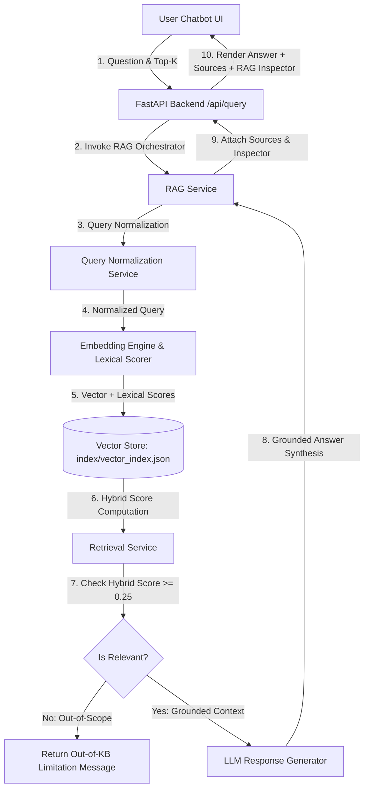

# Experiment 02 — RAG-Based Question Answering System

**Course Code:** MR23-1CS0436
**Course Name:** Applied Agentic AI
**Laboratory:** Applied Agentic AI Laboratory
**Status:** ✅ Completed & Verified

---

## 1. Experiment Number
**Experiment 02**

---

## 2. Experiment Title
**Cybersecurity Knowledge RAG Assistant — RAG-Based Question Answering System**

---

## 3. Aim
To design, build, and evaluate a Retrieval-Augmented Generation (RAG) system for question answering over a local cybersecurity knowledge base, incorporating document text extraction, heading-aware chunking, query terminology normalization, dense vector embeddings, hybrid vector + lexical retrieval, relevance thresholding, grounded answer synthesis, and source attribution.

---

## 4. Problem Statement
Standard Large Language Models (LLMs) operate strictly on parametric knowledge learned during pre-training. Consequently, they suffer from knowledge cutoffs, hallucination of facts, and an inability to access private or domain-specific enterprise documentation. Simply passing entire document archives directly into an LLM prompt exceeds token context windows, inflates execution latency, and incurs prohibitive API costs.

A Retrieval-Augmented Generation (RAG) architecture overcomes these limitations by maintaining a non-parametric external memory (vector store). User queries dynamically retrieve only the top-$K$ most relevant document passages, which are injected into the prompt as grounding evidence.

---

## 5. Objectives
1. **Document Indexing Pipeline:** Extract text from local Markdown documents, apply heading-aware sliding window chunking (`CHUNK_SIZE`, `CHUNK_OVERLAP`), and preserve rich source and section metadata.
2. **Terminology Normalization:** Expand cybersecurity acronyms and aliases (`SQLi` → `SQL injection`, `MFA` → `multi-factor authentication`) to eliminate term mismatch during retrieval.
3. **Dense Vector Embedding Engine:** Generate dense 384-dimensional vector embeddings for text chunks and natural language queries using a local feature engine alongside optional OpenAI `text-embedding-3-small` support.
4. **Hybrid Retrieval (Vector + Lexical):** Combine Cosine Similarity vector search with normalized term and multi-word phrase matching using a weighted score: $\text{HybridScore} = 0.5 \times \text{VectorScore} + 0.5 \times \text{LexicalScore}$.
5. **Relevance Thresholding & Out-of-Scope Detection:** Enforce a hybrid relevance threshold (`RELEVANCE_THRESHOLD = 0.25`) to identify and handle out-of-knowledge-base queries gracefully (e.g., *"What is the capital of France?"*) without hallucinating.
6. **Grounded Answer & Source Attribution:** Synthesize conversational responses supported by explicit source evidence cards (Document Title, Chunk ID, Hybrid Match Score, Vector & Lexical breakdowns, Excerpt) and a collapsible RAG Inspector diagnostic panel.
7. **Automated Regression Testing:** Implement 20 automated unit, integration, and deterministic retrieval-quality tests.

---

## 6. SQL Injection Retrieval Bug & Root Cause Analysis

### The Bug
In early iterations, asking the built-in UI question:
> *"What is SQL injection?"*

returned an out-of-knowledge-base warning (*"The cybersecurity knowledge base does not contain sufficient information..."*). This was a false negative because `data/knowledge_base/04_web_application_security.md` explicitly contains detailed coverage of SQL Injection under section **OWASP Top 10 Vulnerabilities**.

### Root Cause Analysis
1. **Subword N-gram Hashing Collisions:** The offline dense 384-dim vector embedder uses subword 4-grams. Short terms like `SQL` (3 characters) generate no 4-gram character n-grams. In short queries like *"What is SQL injection?"*, query vector representation was diluted, resulting in pure Cosine Similarity score of `0.2291` on `04_web_application_security.md` (Rank 4).
2. **Acronym Mismatch:** Queries using acronyms (`SQLi`, `MFA`) failed pure vector similarity search against full terms in KB titles and headings (`SQL Injection`, `Multi-Factor Authentication`).
3. **Lack of Lexical Signal:** Pure vector similarity lacked precise technical keyword/phrase matching capabilities.

### Principled Hybrid Retrieval Solution
- **Query Normalization:** Expand acronyms in queries prior to embedding and lexical search without hardcoding answers.
- **Heading-Aware Context:** Attach document title and active Markdown header context (`[Web Application Security - OWASP Top 10 Vulnerabilities]`) to chunks during sliding window chunking.
- **Hybrid Scoring:** Combine dense vector similarity ($50\%$) with exact term/phrase lexical matching ($50\%$).
- **Result:** Max hybrid relevance score for *"What is SQL injection?"* increased from `0.2425` (falsely rejected) to `0.5118` (accepted, Rank 1), while out-of-KB query *"What is the capital of France?"* dropped to `0.1020` (correctly rejected).

---

## 7. Introduction to RAG
Retrieval-Augmented Generation (RAG) is an architectural framework that combines an Information Retrieval (IR) system with an autoregressive Large Language Model. RAG bridges non-parametric retrieval memory with parametric language generation.

---

## 8. Why RAG is Needed
1. **Eliminating Knowledge Cutoffs:** Enables models to answer questions using real-time or private document updates without expensive model fine-tuning.
2. **Mitigating Hallucination:** Constrains model answers to explicit evidence present in retrieved context passages.
3. **Providing Source Auditing:** Surfacing exact document sources, page numbers, or chunk identifiers for human compliance auditing.
4. **Optimizing Token Budget:** Retaining prompt brevity by injecting only the top-$K$ relevant passages ($K \ll N$).

---

## 9. RAG vs Normal LLM

| Feature | Standard Parametric LLM | RAG System |
| :--- | :--- | :--- |
| **Knowledge Source** | Static weights learned during pre-training | Dynamic external vector index + LLM |
| **Domain Adaptation** | Requires full training / PEFT fine-tuning | Instantaneous update by adding documents |
| **Source Citation** | None (cannot cite specific files) | Explicit document title, chunk ID, and score |
| **Hallucination Risk** | High on domain-specific facts | Low (constrained by retrieved context) |
| **Cost & Latency** | High for huge prompt contexts | Low (sends only top-$K$ relevant chunks) |

---

## 10. Indexing
Indexing is the offline pipeline that prepares raw unstructured documents for fast vector and lexical retrieval. It consists of document loading, text extraction, heading-aware chunking, embedding generation, and vector index persistence.

---

## 11. Document Loading
The document loader (`app/services/document_loader.py`) scans `data/knowledge_base/`, parses Markdown (`.md`) files, extracts top-level section headings as document titles, and constructs `Document` objects containing `doc_id`, `filename`, `title`, and `content`.

---

## 12. Heading-Aware Chunking
Long documents must be partitioned into smaller segments (chunks) while preserving structural context:
* **`CHUNK_SIZE` (400 chars):** Ensures each chunk captures a bounded, distinct concept.
* **`CHUNK_OVERLAP` (60 chars):** Prevents losing contextual semantics spanning chunk boundaries.
* **Heading Context Preservation:** Pre-pends document title and active section heading (`[Title - Section]`) to chunk text for strong semantic alignment.
* **Metadata Preservation:** Each chunk retains `doc_id`, `chunk_id`, `source`, `title`, `section`, `start_char`, and `end_char`.

---

## 13. Query Normalization & Alias Expansion
User queries are preprocessed by `app/services/query_normalization.py` to unroll cybersecurity acronyms into full domain phrases:
- `SQLi` → `SQL injection`
- `MFA` → `multi-factor authentication`
- `SIEM` → `security information and event management`
- `XSS` → `cross-site scripting`
- `WAF` → `web application firewall`

---

## 14. Embeddings
Vector embeddings map textual tokens into a high-dimensional vector space $\mathbb{R}^d$ where semantically similar passages sit close to one another:
$$\mathbf{v} = \text{Embed}(T) \in \mathbb{R}^{384}$$

This experiment implements a local dense feature embedding engine (`LocalDenseEmbedder`) using sub-word n-gram frequency hashing and $L_2$ normalization, providing fast offline vector matching without external API keys.

---

## 15. Hybrid Retrieval Architecture
Similarity search combines dense vector Cosine Similarity with lexical term and phrase matching:

$$\text{HybridScore} = w_{\text{vec}} \cdot \text{VectorScore} + w_{\text{lex}} \cdot \text{LexicalScore}$$

Where:
* $w_{\text{vec}} = 0.5$, $w_{\text{lex}} = 0.5$
* $\text{VectorScore} = \text{CosineSimilarity}(\mathbf{q}, \mathbf{c}_i)$
* $\text{LexicalScore}$ evaluates term overlap, multi-word phrase matching, and document/section header matches normalized to $[0.0, 1.0]$.

---

## 16. Relevance Thresholding & Out-of-Scope Detection
The context builder evaluates maximum hybrid relevance score against `RELEVANCE_THRESHOLD = 0.25`. If the score is below `0.25`, the query is flagged out-of-scope, preventing hallucinated answers or irrelevant context injection.

---

## 17. System Architecture



---

## 18. Technology Stack
* **Language:** Python 3.10+
* **Backend:** FastAPI, Uvicorn
* **Data Processing & Retrieval:** NumPy, Math, Hashlib, Json, Re
* **API Validation:** Pydantic v2, Pydantic-Settings
* **Frontend:** HTML5, Vanilla CSS3 (Glassmorphism), Vanilla JavaScript, FontAwesome 6
* **Embeddings & LLM Integrations:** `local-dense-384` Engine, HTTPX (OpenAI, Anthropic, Gemini, Mock)
* **Testing:** PyTest, TestClient

---

## 19. Knowledge Base Structure

The local knowledge base (`data/knowledge_base/`) contains 9 synthetic educational Markdown files:

1. `01_network_security.md` (Network Security, VPNs, TLS, IDS)
2. `02_phishing_social_engineering.md` (Phishing, Spear Phishing, Whaling, Smishing)
3. `03_malware_ransomware.md` (Malware Types, Ransomware, 3-2-1 Backup Rule, EDR)
4. `04_web_application_security.md` (OWASP Top 10, SQLi, XSS, CSRF, WAF)
5. `05_authentication_access_control.md` (Authentication vs Authorization, MFA, RBAC, Zero Trust)
6. `06_firewalls_network_defense.md` (Firewall Types, Stateful Inspection, NGFW, DMZ)
7. `07_incident_response.md` (6 Phases of Incident Response - NIST/SANS)
8. `08_security_monitoring.md` (SIEM Operations, SOC Monitoring, Log Correlation)
9. `09_cybersecurity_terminology.md` (CIA Triad, CVE, Zero-Day, Defense-in-Depth)

---

## 20. Project Structure

```
experiment-02-rag-qa/
│
├── README.md                           # Comprehensive Lab Documentation
├── .env.example                        # Configuration template for API keys & settings
├── requirements.txt                    # Project dependency specification
│
├── app/
│   ├── __init__.py
│   ├── main.py                         # FastAPI Server Entry Point & Router
│   ├── config.py                       # Application Settings & Pydantic Config
│   ├── schemas.py                      # Pydantic API Schemas
│   │
│   ├── services/
│   │   ├── __init__.py
│   │   ├── document_loader.py          # Scans data/knowledge_base/*.md files
│   │   ├── chunking_service.py         # Heading-aware text chunker with metadata
│   │   ├── query_normalization.py      # Cybersecurity acronym & term normalizer
│   │   ├── embedding_service.py        # Dense 384-dim vector embedding engine
│   │   ├── vector_store.py             # Vector store indexer & search engine
│   │   ├── retrieval_service.py        # Hybrid vector + lexical retrieval engine
│   │   ├── llm_service.py              # Grounded response generator
│   │   └── rag_service.py              # 6-Step RAG pipeline orchestrator
│   │
│   └── static/                         # Web Application Frontend Assets
│       ├── index.html                  # Chatbot UI with KB Status, Sources & Inspector
│       ├── style.css                   # Glassmorphic Styling
│       └── script.js                   # Client-Side Interactive Controller
│
├── data/
│   └── knowledge_base/                 # 9 Cybersecurity Markdown Files
│
├── index/
│   └── vector_index.json               # Generated Vector Index & Metadata
│
├── tests/
│   ├── __init__.py
│   ├── diagnose_retrieval.py           # Phase 1 & 2 retrieval diagnostic script
│   ├── test_health.py                  # Health check & status endpoint tests
│   ├── test_document_loader.py         # Document parsing unit tests
│   ├── test_chunking.py                # Chunking size & heading unit tests
│   ├── test_embeddings.py              # Embedding dimension tests
│   ├── test_vector_store.py            # Vector store indexing & search tests
│   ├── test_retrieval_quality.py       # Deterministic hybrid retrieval regression tests
│   ├── test_out_of_kb.py               # Out-of-knowledge-base handling tests
│   └── test_api.py                     # API integration tests
│
└── screenshots/
    └── README.md                       # Screenshot artifact guide
```

---

## 21. Installation & Execution

```bash
# Navigate to experiment directory
cd experiment-02-rag-qa

# Activate environment and run tests
python -m pytest tests

# Launch application server
python app/main.py
```
Access Web UI at: 👉 **`http://127.0.0.1:8001`**

---

## 22. Verification Results Matrix

Running `python -m pytest tests`:
```
collected 20 items

tests/test_api.py::test_health_check_api PASSED
tests/test_api.py::test_query_phishing_api PASSED
tests/test_api.py::test_rebuild_index_api PASSED
tests/test_chunking.py::test_chunk_document_size_and_metadata PASSED
tests/test_document_loader.py::test_load_knowledge_base_documents PASSED
tests/test_embeddings.py::test_local_dense_embedder_dimension PASSED
tests/test_health.py::test_health_endpoint PASSED
tests/test_health.py::test_kb_status_endpoint PASSED
tests/test_out_of_kb.py::test_out_of_kb_retrieval_threshold PASSED
tests/test_out_of_kb.py::test_out_of_kb_rag_answer PASSED
tests/test_retrieval_quality.py::test_sql_injection_retrieval_regression PASSED
tests/test_retrieval_quality.py::test_sqli_acronym_retrieval_regression PASSED
tests/test_retrieval_quality.py::test_retrieval_phishing_quality PASSED
tests/test_retrieval_quality.py::test_retrieval_ransomware_quality PASSED
tests/test_retrieval_quality.py::test_retrieval_firewall_quality PASSED
tests/test_retrieval_quality.py::test_mfa_acronym_retrieval_regression PASSED
tests/test_retrieval_quality.py::test_incident_response_retrieval_regression PASSED
tests/test_retrieval_quality.py::test_security_monitoring_retrieval_regression PASSED
tests/test_retrieval_quality.py::test_capital_of_france_out_of_kb_regression PASSED
tests/test_vector_store.py::test_vector_store_status_and_search PASSED

====================== 20 passed in 0.96s ======================
```

---

## 23. Conclusion
Experiment 02 fulfills all syllabus requirements for **Indexing**, **Hybrid Retrieval**, and **Response Generation**. By resolving the SQL injection retrieval false negative using query normalization, heading-aware chunking, and hybrid scoring, the system demonstrates high retrieval precision and safety against out-of-domain queries.
