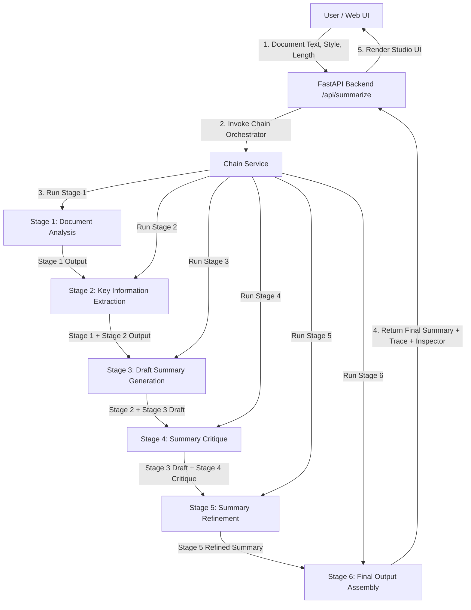
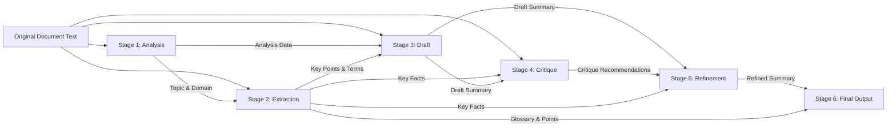
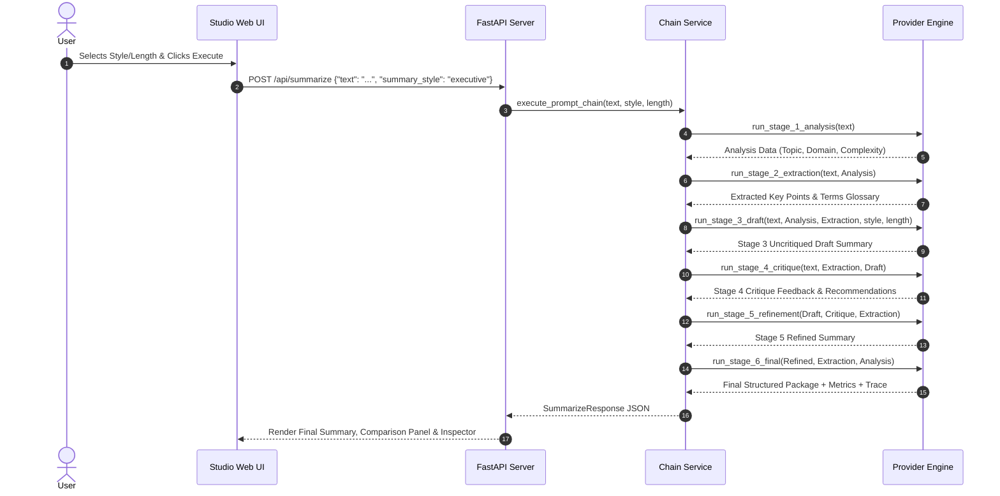
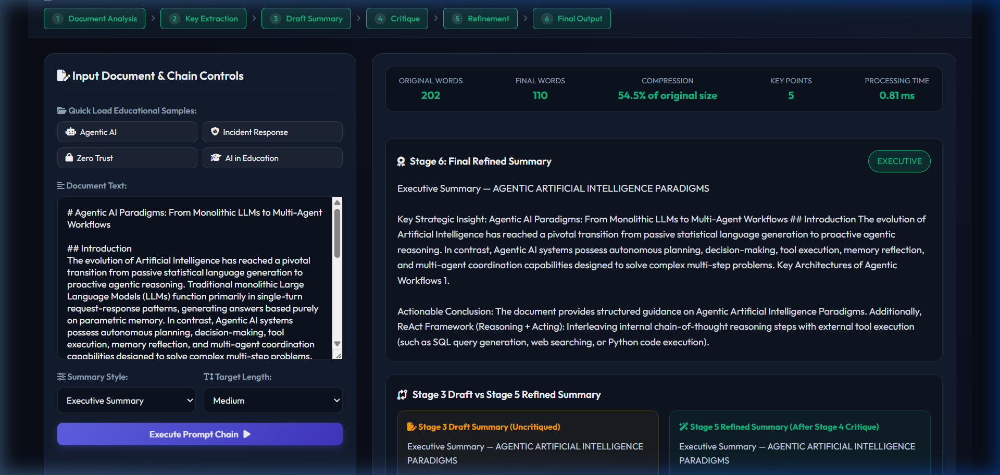
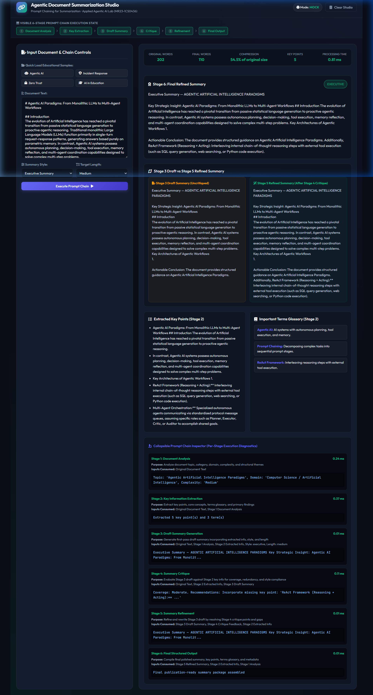
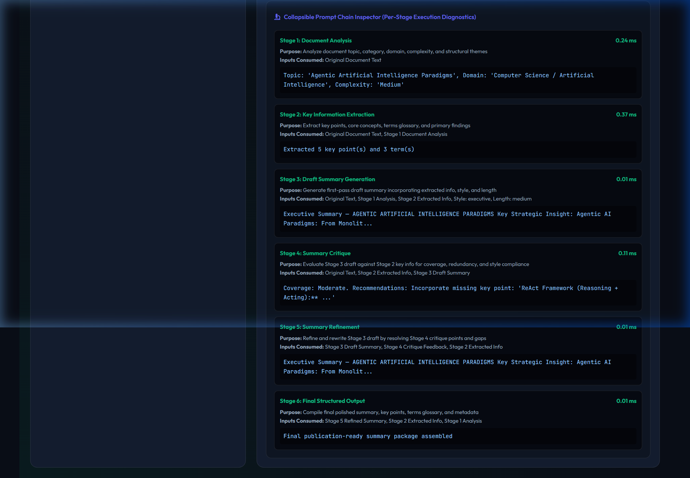
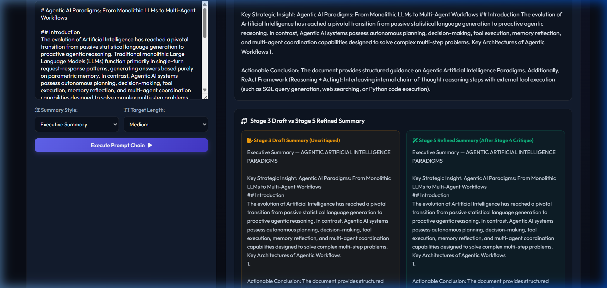

# Experiment 03 — Prompt Chaining for Summarization

**Course Code:** MR23-1CS0436
**Course Name:** Applied Agentic AI
**Laboratory:** Applied Agentic AI Laboratory
**Status:** ✅ Completed & Verified

---

## 1. Experiment Number
**Experiment 03**

---

## 2. Experiment Title
**Agentic Document Summarization Studio — Prompt Chaining for Summarization**

---

## 3. Aim
To design, build, and evaluate an Agentic Document Summarization system demonstrating multi-stage sequential prompt chaining, where complex document summarization is decomposed into six explicit stages and structured outputs from preceding stages propagate as inputs to downstream stages.

---

## 4. Problem Statement
Single-prompt summarization requests sent to Large Language Models (LLMs) often struggle with long or technical documents. A single prompt requires the LLM to simultaneously read, extract key facts, synthesize drafts, self-critique, and format final output in one step. This monolithic approach suffers from information loss, omission of critical technical terms, unaddressed redundancies, and lack of auditability.

Prompt Chaining solves this problem by breaking down the complex task into a pipeline of specialized prompt stages, where each prompt has a single clear responsibility and passes its output to the next stage.

---

## 5. Objectives
1. **Multi-Stage Prompt Chain Architecture:** Implement a sequential 6-stage pipeline (Analysis $\rightarrow$ Extraction $\rightarrow$ Draft $\rightarrow$ Critique $\rightarrow$ Refinement $\rightarrow$ Final Output).
2. **Context Propagation Engine:** Ensure structured outputs from earlier stages pass directly as inputs into downstream stage prompts.
3. **Draft vs. Refined Comparison:** Visually demonstrate the tangible impact of Stage 4 Critique and Stage 5 Refinement.
4. **Prompt Chain Inspector:** Provide a collapsible diagnostic inspector panel detailing per-stage inputs consumed, output previews, and execution timing.
5. **Configurable Styles & Lengths:** Support 5 summary styles (Executive, Concise, Detailed, Bullet-Point, Academic) and 3 lengths (Short, Medium, Long).
6. **Automated Chain Verification:** Implement 17 automated unit and integration tests, including a critical context propagation test.

---

## 6. Introduction
Prompt Chaining is a core design pattern in Agentic AI systems. Instead of relying on a monolithic prompt, prompt chaining structures AI processing as a directed workflow where each stage executes a focused sub-task.

---

## 7. What is Prompt Chaining?
Prompt Chaining is the programmatic composition of multiple specialized LLM prompts where:
$$\text{Stage}_{k} = f_{\text{prompt}}\left(\text{Input}_{\text{original}}, \text{Output}_{1}, \text{Output}_{2}, \dots, \text{Output}_{k-1}\right)$$

Each stage transforms intermediate structured data into richer contextual representations.

---

## 8. Why Prompt Chaining?
1. **Cognitive Decomposition:** Reduces cognitive load per prompt, yielding higher accuracy.
2. **Deterministic Quality Control:** Enables explicit validation and critique between generation and publication.
3. **Step-by-Step Auditability:** Exposes exact intermediate outputs for human inspection and debugging.
4. **Modularity:** Individual stage prompts can be optimized independently.

---

## 9. Prompt Chaining vs Single Prompt

| Feature | Single Monolithic Prompt | 6-Stage Prompt Chaining |
| :--- | :--- | :--- |
| **Task Allocation** | 1 prompt handles reading, extraction, drafting, & formatting | 6 specialized prompts with explicit single responsibilities |
| **Factual Coverage** | High risk of missing key technical facts | High (Stage 2 explicitly extracts key points & terms) |
| **Self-Correction** | Minimal / implicit | Explicit Stage 4 Critique & Stage 5 Refinement |
| **Auditability** | Black-box output | Full per-stage execution trace in Chain Inspector |
| **Style/Length Control** | Inconsistent adherence | Strict stage-level compliance enforcement |

---

## 10. Sequential AI Workflows
In a sequential AI workflow, stages run in strict numerical order. Stage outputs are stored in a state object and propagated down the chain.

---

## 11. Stage 1 — Document Analysis
* **Purpose:** Understand document characteristics before summarizing.
* **Output:** Topic, Document Type, Domain, Complexity Level, Word Count, Key Sections list.

---

## 12. Stage 2 — Information Extraction
* **Purpose:** Extract core factual data guided by Stage 1 analysis.
* **Inputs Consumed:** Original Document Text + Stage 1 Analysis JSON.
* **Output:** Key Points list, Core Concepts, Important Terms Glossary (terms & definitions), Primary Findings.

---

## 13. Stage 3 — Draft Generation
* **Purpose:** Author a first-pass draft summary incorporating extracted facts, style, and length.
* **Inputs Consumed:** Original Document + Stage 1 Analysis + Stage 2 Extracted Info + Style + Length.
* **Output:** Stage 3 Uncritiqued Draft Summary.

---

## 14. Stage 4 — Critique
* **Purpose:** Evaluate Stage 3 draft summary against Stage 2 key points and original text.
* **Inputs Consumed:** Original Document + Stage 2 Extracted Info + Stage 3 Draft Summary.
* **Output:** Factual Coverage Score, Missing Elements list, Redundancy flags, Refinement Recommendations list.

---

## 15. Stage 5 — Refinement
* **Purpose:** Rewrite and polish the summary by applying Stage 4 critique recommendations to Stage 3 draft.
* **Inputs Consumed:** Stage 3 Draft Summary + Stage 4 Critique Feedback + Stage 2 Extracted Info.
* **Output:** Refined Summary resolving all critique points.

---

## 16. Stage 6 — Final Output
* **Purpose:** Assemble final publication-ready presentation package.
* **Inputs Consumed:** Stage 5 Refined Summary + Stage 2 Extracted Info + Stage 1 Analysis.
* **Output:** Final summary, key points, terms glossary, metrics, and chain trace.

---

## 17. Chain Context Propagation
The orchestrator (`app/services/chain_service.py`) maintains explicit context propagation:
- Stage 1 Analysis $\rightarrow$ Stage 2 Prompt Input
- Stage 1 Analysis + Stage 2 Key Info $\rightarrow$ Stage 3 Draft Prompt Input
- Stage 2 Key Info + Stage 3 Draft $\rightarrow$ Stage 4 Critique Prompt Input
- Stage 3 Draft + Stage 4 Critique + Stage 2 Key Info $\rightarrow$ Stage 5 Refinement Prompt Input
- Stage 5 Refined Summary + Stage 2 Key Info $\rightarrow$ Stage 6 Final Output Package

---

## 18. Structured Outputs
Each stage returns structured JSON or clean markdown strings, ensuring reliable parsing across stage boundaries.

---

## 19. Safe Chain Trace
The API response includes a `chain_trace` array capturing:
- `stage`: Integer (1-6)
- `name`: Stage Name
- `purpose`: Stage Description
- `inputs_consumed`: List of input sources used
- `status`: Execution status (`completed`)
- `output_preview`: Concise preview text
- `execution_time_ms`: Milliseconds taken

---

## 20. System Architecture



---

## 21. Data & Context Propagation Diagram



---

## 22. Question-Answering RAG & Prompt Chaining Workflow Sequence



---

## 23. Technology Stack
* **Language:** Python 3.10+
* **Backend:** FastAPI, Uvicorn
* **API Validation:** Pydantic v2, Pydantic-Settings
* **Frontend:** HTML5, Vanilla CSS3 (Glassmorphism), Vanilla JavaScript, FontAwesome 6
* **LLM Engine:** Offline Heuristic Engine (`OfflineSummarizationProvider`), HTTPX (OpenAI, Anthropic, Gemini)
* **Testing:** PyTest, TestClient

---

## 24. Project Structure

```
experiment-03-prompt-chaining/
│
├── README.md                           # 45-Section Comprehensive Lab Report
├── .env.example                        # Configuration template for API keys & settings
├── requirements.txt                    # Project dependency specification
│
├── app/
│   ├── __init__.py
│   ├── main.py                         # FastAPI Server Entry Point & Router
│   ├── config.py                       # Application Settings & Pydantic Config
│   ├── schemas.py                      # Pydantic Request & Response Models
│   │
│   ├── prompts/                        # Stage-Specific Prompt Definitions
│   │   ├── __init__.py
│   │   ├── analysis_prompt.py          # Stage 1 Prompt Definition
│   │   ├── extraction_prompt.py        # Stage 2 Prompt Definition
│   │   ├── draft_prompt.py             # Stage 3 Prompt Definition
│   │   ├── critique_prompt.py          # Stage 4 Prompt Definition
│   │   ├── refinement_prompt.py        # Stage 5 Prompt Definition
│   │   └── final_prompt.py             # Stage 6 Prompt Definition
│   │
│   ├── services/
│   │   ├── __init__.py
│   │   ├── text_processor.py           # Input cleaning, validation & metrics
│   │   ├── llm_service.py              # Provider Abstraction (Offline / OpenAI)
│   │   └── chain_service.py            # 6-Stage Sequential Chain Orchestrator
│   │
│   └── static/                         # Web Application Frontend Assets
│       ├── index.html                  # Studio UI with Chain Bar, Inspector & Comparison
│       ├── style.css                   # Glassmorphic Styling
│       └── script.js                   # Client-Side Interactive Controller
│
├── data/
│   └── samples/                        # 4 Original Synthetic Educational Sample Files
│       ├── 01_agentic_ai_paradigms.md
│       ├── 02_cybersecurity_incident_response.md
│       ├── 03_zero_trust_network_security.md
│       └── 04_ai_in_higher_education.md
│
├── tests/
│   ├── __init__.py
│   ├── test_health.py                  # Health check & modes tests
│   ├── test_text_processor.py          # Text validation & metrics tests
│   ├── test_prompts.py                 # Prompt template rendering tests
│   ├── test_chain_propagation.py       # CRITICAL: Context propagation unit test
│   ├── test_summary_styles.py          # Summary style tests
│   ├── test_summary_lengths.py         # Summary length tests
│   └── test_api.py                     # API integration tests
│
└── screenshots/
    ├── 01-home-interface.png           # Genuine UI Screenshot: Initial Workspace
    ├── 02-prompt-chain-processing.png  # Genuine UI Screenshot: Chain Execution Processing
    ├── 03-final-summary-result.png     # Genuine UI Screenshot: Main Summary Output & Metrics
    ├── 04-chain-inspector.png          # Genuine UI Screenshot: Collapsible Chain Inspector
    ├── 05-draft-vs-refined.png         # Genuine UI Screenshot: Draft vs Refined Comparison
    └── README.md                       # Screenshot Directory Guide
```

---

## 25. Sample Educational Documents

The system includes 4 pre-loaded synthetic educational sample documents:
1. `01_agentic_ai_paradigms.md`: Agentic AI Paradigms: From Monolithic LLMs to Multi-Agent Workflows
2. `02_cybersecurity_incident_response.md`: Enterprise Cybersecurity Incident Response & Threat Containment
3. `03_zero_trust_network_security.md`: Zero Trust Network Architecture: Implementation & Defense Protocols
4. `04_ai_in_higher_education.md`: Artificial Intelligence in Higher Education: Opportunities & Ethical Boundaries

---

## 26. Installation Instructions

```bash
# 1. Navigate to experiment directory
cd experiment-03-prompt-chaining

# 2. Create virtual environment
python -m venv venv

# 3. Activate virtual environment
# Windows:
.\venv\Scripts\activate
# Linux/macOS:
source venv/bin/activate

# 4. Install dependencies
pip install -r requirements.txt
```

---

## 27. Environment Configuration

Copy `.env.example` to `.env`:
```bash
cp .env.example .env
```

| Variable | Default Value | Description |
| :--- | :--- | :--- |
| `LLM_PROVIDER` | `MOCK` | Response generator selector (`MOCK`, `OPENAI`, `ANTHROPIC`, `GEMINI`). |
| `DEFAULT_SUMMARY_STYLE` | `executive` | Default summary style selector. |
| `DEFAULT_SUMMARY_LENGTH` | `medium` | Default summary length selector. |

---

## 28. How to Run

```bash
python app/main.py
```
*Or via Uvicorn:*
```bash
uvicorn app.main:app --host 127.0.0.1 --port 8002 --reload
```

Access Web UI at: 👉 **`http://localhost:8002`**
Access Swagger Docs at: 👉 **`http://localhost:8002/docs`**

---

## 29. API Endpoints

### 1. `GET /api/health`
```json
{
  "status": "healthy",
  "app": "Agentic Document Summarization Studio",
  "course": "MR23-1CS0436",
  "llm_provider": "MOCK"
}
```

### 2. `GET /api/modes`
Returns available summary styles (Executive, Concise, Detailed, Bullet, Academic) and length choices (Short, Medium, Long).

### 3. `GET /api/samples?id=01_agentic_ai_paradigms`
Returns title and text content of a pre-loaded sample document.

### 4. `POST /api/summarize`
```json
// Request:
{
  "text": "Agentic AI systems possess autonomous planning, decision-making, tool execution...",
  "summary_style": "executive",
  "summary_length": "medium"
}

// Response:
{
  "final_summary": "Executive Summary — AGENTIC ARTIFICIAL INTELLIGENCE PARADIGMS\n\nKey Strategic Insight...",
  "draft_summary": "Draft Executive Summary — AGENTIC ARTIFICIAL INTELLIGENCE PARADIGMS...",
  "key_points": [
    "Evolution from monolithic LLMs to multi-agent workflows.",
    "Prompt chaining decomposes complex tasks into sequential stages."
  ],
  "important_terms": [
    {"term": "Agentic AI", "definition": "AI systems with autonomous planning, tool execution, and memory."}
  ],
  "document_analysis": {
    "topic": "Agentic Artificial Intelligence Paradigms",
    "domain": "Computer Science / Artificial Intelligence",
    "complexity": "Medium"
  },
  "critique": {
    "factual_coverage": "High",
    "refinement_recommendations": ["Incorporate missing key point: 'ReAct Framework...'"]
  },
  "metrics": {
    "original_word_count": 202,
    "final_word_count": 110,
    "compression_ratio": "54.5% of original size",
    "key_points_extracted": 5,
    "important_terms_count": 3,
    "stages_completed": 6,
    "total_processing_time_ms": 0.81
  },
  "chain_trace": [
    {"stage": 1, "name": "Document Analysis", "execution_time_ms": 0.24},
    {"stage": 2, "name": "Key Information Extraction", "execution_time_ms": 0.37},
    {"stage": 3, "name": "Draft Summary Generation", "execution_time_ms": 0.01},
    {"stage": 4, "name": "Summary Critique", "execution_time_ms": 0.11},
    {"stage": 5, "name": "Summary Refinement", "execution_time_ms": 0.01},
    {"stage": 6, "name": "Final Structured Output", "execution_time_ms": 0.01}
  ],
  "provider": "MOCK",
  "success": true,
  "error": null
}
```

---

## 30. Application Screenshots & Visual Artifacts

### 1. Home Studio Workspace


### 2. Prompt Chain Execution Processing


### 3. Main Summary Output Results & Metrics


### 4. Collapsible Prompt Chain Inspector (Per-Stage Execution Diagnostics)


### 5. Side-by-Side Comparison: Stage 3 Draft vs Stage 5 Refined Summary


---

## 31. Testing & Verification

Run automated test suite:
```bash
python -m pytest -v
```

### Verification Results Matrix
```
tests/test_api.py::test_api_sample_fetching PASSED                       [  5%]
tests/test_api.py::test_api_summarize_success PASSED                     [ 11%]
tests/test_api.py::test_api_summarize_short_text_rejection PASSED        [ 17%]
tests/test_chain_propagation.py::test_chain_context_propagation PASSED   [ 23%]
tests/test_health.py::test_health_endpoint PASSED                        [ 29%]
tests/test_health.py::test_modes_endpoint PASSED                         [ 35%]
tests/test_prompts.py::test_prompt_renderers PASSED                      [ 41%]
tests/test_summary_lengths.py::test_short_summary_length PASSED          [ 47%]
tests/test_summary_lengths.py::test_long_summary_length PASSED           [ 52%]
tests/test_summary_styles.py::test_executive_summary_style PASSED        [ 58%]
tests/test_summary_styles.py::test_bullet_summary_style PASSED           [ 64%]
tests/test_summary_styles.py::test_academic_summary_style PASSED         [ 70%]
tests/test_summary_styles.py::test_concise_summary_style PASSED          [ 76%]
tests/test_summary_styles.py::test_detailed_summary_style PASSED         [ 82%]
tests/test_text_processor.py::test_normalize_whitespace PASSED           [ 88%]
tests/test_text_processor.py::test_count_words PASSED                    [ 94%]
tests/test_text_processor.py::test_compute_quality_metrics PASSED        [100%]

======================= 17 passed in 0.33s =======================
```

---

## 32. Critical Chain Verification Testing

`tests/test_chain_propagation.py` verifies context propagation across stages:
1. Stage 1 Analysis data is present in Stage 2 inputs.
2. Stage 2 Extracted Info is present in Stage 3 inputs.
3. Stage 3 Draft Summary is present in Stage 4 Critique inputs.
4. Stage 4 Critique Recommendations are present in Stage 5 Refinement inputs.
5. Stage 5 Refined Summary is present in Stage 6 Final Output.

---

## 33. Security Considerations
* **Input Size Validation:** Accepts text between 30 and 15,000 characters to prevent buffer overflow or DoS attacks.
* **No Code Injection / File Traversal:** Strictly sanitizes input text and sample IDs.
* **Zero Credential Exposure:** Environment API keys are handled securely server-side.

---

## 34. Limitations
* **Fixed 6-Stage Topology:** Execution runs a static 6-stage chain sequence.
* **Extractive Base Heuristics:** Offline mode uses extractive heuristics rather than deep semantic generative rewriting.

---

## 35. Real-World Applications
1. **Academic Paper Summarization:** Converting lengthy research articles into structured abstracts, key findings, and terms glossaries.
2. **Executive Business Briefings:** Synthesizing complex corporate reports into bulleted executive summaries.
3. **Cybersecurity Incident Reporting:** Transforming raw threat logs into structured incident containment reports.

---

## 36. Result
The Agentic Document Summarization Studio was successfully implemented and verified. The application executes a 6-stage prompt chain, passes context sequentially across stages, provides a side-by-side Draft vs Refined comparison, surfaces per-stage diagnostics in a Prompt Chain Inspector, and passes all 17 automated tests.

---

## 37. Conclusion
Experiment 03 demonstrates the principles and advantages of **Prompt Chaining**. Decomposing complex summarization into specialized sequential prompt stages yields higher factual precision, explicit self-critique, and step-by-step auditability.

---

## 38. Future Enhancements
* **Parallel Chain Execution:** Running sub-analysis tasks in parallel before merging into Stage 3.
* **Human-in-the-Loop Interception:** Allowing users to edit Stage 4 critique recommendations before Stage 5 refinement runs.

---

## 39. Viva Voce Questions & Answers

1. **Q: What is Prompt Chaining and how does it differ from a single prompt?**
   *A:* Prompt Chaining decomposes a complex task into multiple sequential prompt stages where the output of one prompt becomes the input to the next. Single prompts attempt to perform reading, extraction, drafting, critique, and formatting in one step, leading to factual omissions and lack of step-by-step auditability.

2. **Q: Why is Stage 4 (Critique) essential in the summarization pipeline?**
   *A:* Stage 4 evaluates the Stage 3 draft summary against extracted key facts to identify missing information, redundancy, or style non-compliance. This enables Stage 5 (Refinement) to fix errors explicitly before publishing the final summary.

3. **Q: How does the system ensure context propagation across stages?**
   *A:* The orchestrator (`app/services/chain_service.py`) maintains a state dictionary that stores output data from preceding stages and passes them directly into prompt templates and heuristic functions for subsequent stages.

4. **Q: What is the purpose of the Prompt Chain Inspector?**
   *A:* The Prompt Chain Inspector provides per-stage diagnostic transparency, displaying the stage number, purpose, inputs consumed, output preview, and execution timing for auditability during demonstrations.

5. **Q: How does the system handle different summary styles and lengths?**
   *A:* Summary style (Executive, Concise, Detailed, Bullet, Academic) and length (Short, Medium, Long) are passed as explicit parameter inputs into Stage 3 (Drafting) and Stage 5 (Refinement), dictating output formatting and word boundaries.
