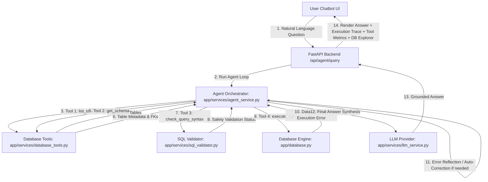
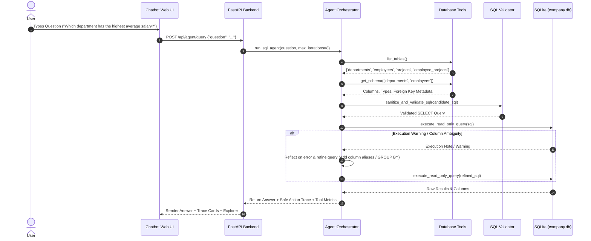

# Experiment 04 — Autonomous ReAct SQL Agent with Tool Use

**Course Code:** MR23-1CS0436
**Course Name:** Applied Agentic AI
**Laboratory:** Applied Agentic AI Laboratory
**Status:** ✅ Completed & Verified
**Directory:** `experiment-04-sql-agent`
**Port:** `8003`

---

## 🎯 A. Experiment Title
**Autonomous ReAct SQL Agent with Tool Use**

---

## 📚 B. Course Details
- **Course Code:** MR23-1CS0436
- **Course Name:** Applied Agentic AI
- **Laboratory:** Applied Agentic AI Laboratory
- **Module Type:** Tool Augmented ReAct Agentic Reasoning

---

## 📌 C. Status
✅ **Completed & Verified** (23 Automated Tests Passed, Runtime UI Verified on Port 8003)

---

## 🎯 D. Aim
To design, build, and evaluate an autonomous SQL agent operating in a controlled ReAct (DECIDE → ACT → OBSERVE → VALIDATE → RETRY/FINISH) loop, equipped with four specialized database tools (`list_tables`, `get_schema`, `check_query_syntax`, `execute_sql`), schema reflection, read-only safety controls, and automated error reflection with query auto-correction.

---

## 🎯 E. Learning Objectives
1. **Tool Augmented Reasoning Loops:** Implement a bounded ReAct iteration loop where the agent dynamically selects tools based on runtime observations.
2. **Safe Structured Agent Trace:** Maintain an auditable execution trace detailing step decisions, tool invocations, sanitized parameters, and observations without exposing hidden chain-of-thought text.
3. **Database Schema Reflection:** Enable agents to inspect tables and schema definitions dynamically rather than assuming fixed database structures.
4. **Error Reflection & Auto-Correction:** Implement reflection mechanisms that capture SQL execution warnings or errors, analyze root causes against schema metadata, and refine candidate queries autonomously.

---

## 📜 F. Problem Statement
In traditional single-pass Text-to-SQL workflows (like Experiment 01), a natural language query is translated into SQL and executed in a single static step. If the generated SQL fails due to an ambiguous column name, missing JOIN condition, or syntax error, the workflow halts and fails. A single LLM prompt cannot self-correct upon execution failure. An **Autonomous ReAct SQL Agent** addresses this by iteratively inspecting available tables, retrieving exact schemas, validating candidate syntax, executing queries, observing database results, reflecting on errors, and auto-correcting candidate SQL until a grounded answer is produced.

---

## 💡 G. ReAct & Tool-Use Concept Overview
The agent operates in a bounded iterative reasoning loop:
1. **DECIDE:** Evaluate current question state and determine the next safe action.
2. **ACT:** Select and invoke one permitted database tool (`list_tables`, `get_schema`, `check_query_syntax`, `execute_sql`).
3. **OBSERVE:** Capture structured JSON observations or database error messages returned by the tool.
4. **VALIDATE:** Pass generated SQL through token-based read-only security validation.
5. **RETRY / FINISH:** Reflect on errors, refine query parameters if needed, or synthesize the final grounded natural language answer once a valid result set is retrieved.

---

## 🔄 H. Key Differences: Experiment 01 vs. Experiment 04

| Dimension | Experiment 01 — Text-to-SQL | Experiment 04 — ReAct SQL Agent |
| :--- | :--- | :--- |
| **Execution Pattern** | Single-pass linear 6-step workflow | Dynamic multi-step ReAct decision loop |
| **Tool Usage** | Static service invocations | Autonomous tool selection (`list_tables`, `get_schema`, etc.) |
| **Error Handling** | Fails immediately on database error | Reflects on error messages and auto-corrects candidate SQL |
| **Database Domain** | University Database (`university.db`) | Company Analytics Database (`company.db`) |
| **Iteration Control** | Fixed single pass | Bounded loop (`MAX_AGENT_ITERATIONS = 8`) |
| **Trace Display** | Static workflow progress bar | Interactive Safe Agent Execution Trace Timeline |

---

## 🏗️ I. System Architecture



---

## 🔄 J. Agent Execution Workflow



---

## 🛠️ K. Tool Definitions

1. **`list_tables`**: Returns all permitted user tables (`departments`, `employees`, `projects`, `employee_projects`) in structured JSON format.
2. **`get_schema`**: Inspects columns, data types, primary keys, foreign key relationships, and row counts for requested tables.
3. **`check_query_syntax`**: Validates an SQL query string for read-only compliance and basic structure before execution.
4. **`execute_sql`**: Validates and executes a read-only `SELECT` query against `company.db`, returning column names, rows, row count, and execution errors.

---

## 🗄️ L. Database Schema (`company.db`)

The self-contained demonstration database represents a **Company Analytics** domain with 4 relational tables:
- **`departments`**: `id` (PK), `name`, `code`, `location`, `budget` (5 records)
- **`employees`**: `id` (PK), `name`, `roll_code`, `department_id` (FK), `job_title`, `salary`, `hire_date` (20 records)
- **`projects`**: `id` (PK), `name`, `department_id` (FK), `budget`, `status` (8 records)
- **`employee_projects`**: `id` (PK), `employee_id` (FK), `project_id` (FK), `hours_allocated` (30 records)

---

## 📁 M. Folder & File Structure

```
experiment-04-sql-agent/
├── README.md                           # Lab Report & Comprehensive Documentation
├── requirements.txt                    # Project Dependencies
├── .env.example                        # Environment Template
├── app/
│   ├── __init__.py                     # Package Initializer
│   ├── main.py                         # FastAPI Server Entry Point & Router (Port 8003)
│   ├── config.py                       # Pydantic Settings
│   ├── database.py                     # SQLite Connection Engine & Read-Only Executor
│   ├── models.py                       # SQLAlchemy ORM Models (Department, Employee, Project, EmployeeProject)
│   ├── schemas.py                      # Pydantic Schemas (AgentQueryRequest, AgentQueryResponse, ToolCallTrace)
│   ├── services/
│   │   ├── __init__.py
│   │   ├── database_tools.py           # Implementation of 4 Database Agent Tools
│   │   ├── sql_validator.py            # Token-Based Read-Only SQL Security Validator
│   │   ├── llm_service.py              # LLM Decision Engine (Mock & Real Providers)
│   │   └── agent_service.py            # ReAct Autonomous Agent Loop Orchestrator
│   └── static/                         # Glassmorphic UI Assets (index.html, style.css, app.js)
├── data/
│   ├── company.db                      # SQLite Relational Database (4 tables)
│   └── seed.py                         # Database Seeding Script
├── tests/                              # 23 Automated PyTest Unit & Integration Tests
│   ├── test_health.py
│   ├── test_database_tools.py
│   ├── test_sql_validator.py
│   ├── test_agent_service.py
│   └── test_api.py
└── screenshots/                        # 6 Verified Screenshot Artifacts & README
```

---

## 💻 N. Technology Stack
- **Python 3.10+**: Runtime Programming Language
- **FastAPI / Uvicorn**: Web Application Framework & ASGI Server (Port 8003)
- **SQLite 3 & SQLAlchemy**: Relational Database Engine & ORM
- **Pydantic v2**: API Schema Validation & Serialization
- **Vanilla HTML5/CSS3/JS**: Glassmorphic Agent Workbench UI

---

## ⚙️ O. Environment Setup & Installation

### Windows PowerShell:
```powershell
cd "D:\Agentic AI Experiments\experiment-04-sql-agent"
python -m venv venv
.\venv\Scripts\activate
pip install -r requirements.txt
Copy-Item .env.example .env
python data/seed.py
```

### Linux / macOS:
```bash
cd "D:/Agentic AI Experiments/experiment-04-sql-agent"
python3 -m venv venv
source venv/bin/activate
pip install -r requirements.txt
cp .env.example .env
python3 data/seed.py
```

---

## 🚀 P. Exact Execution Procedure

```powershell
# Ensure virtual environment is active in PowerShell
.\venv\Scripts\activate

# Launch application server on port 8003
python -m app.main
```

#### Exact Browser URL
👉 **`http://127.0.0.1:8003`**

---

## 🖥️ Q. How to Use the UI
1. **Header Bar:** Displays title *"Autonomous ReAct SQL Agent with Tool Use"*, course code `MR23-1CS0436`, status badges (`company.db`, Port `8003`), and Agent Mode (`Offline Mock`).
2. **Sample Questions Bar:** Click quick prompt chips (e.g., *"Highest Avg Salary"*, *"Top Active Project"*, *"Max Project Hours"*, *"Top 3 Salary Costs"*, *"Active Project Team"*).
3. **Agent Controls:** Select Max Iteration Guard limit (4, 8, or 12 iterations) and click *"Execute ReAct Agent"*.
4. **Tool Usage Metrics Card:** Real-time counters tracking calls to `list_tables`, `get_schema`, `check_query_syntax`, `execute_sql`, retries, and total calls.
5. **Grounded Database Answer Card:** Synthesized natural language explanation with database values.
6. **Executed SQL & Data Table Card:** Formatted SQL query block with copy button and tabular result set.
7. **Safe Agent Execution Trace Timeline:** Chronological step cards showing decision summaries, tool invocations, sanitized parameters, observations, and status badges.
8. **Database Explorer:** Tabbed schema viewer for `departments`, `employees`, `projects`, and `employee_projects`.

---

## ❓ R. Sample Questions & Expected Answers

1. **Question:** *"Which department has the highest average employee salary, and how many employees work there?"*
   **Answer:** Product Management has the highest average salary (**$127,000.00**) with **3** active employees.

2. **Question:** *"Which active project has the largest budget and which department owns it?"*
   **Answer:** Next-Gen Cloud Orchestration owned by Cloud Infrastructure with an allocated budget of **$520,000.00**.

3. **Question:** *"Which employee is assigned the highest total project hours?"*
   **Answer:** Peter Parker (Principal DevOps Architect) with **230 hours** allocated across technical projects.

---

## 🛡️ S. Safety & Security Controls
- **Quote-Aware Token-Based Read-Only Validation:** `app/services/sql_validator.py` strips quoted string literals before token analysis, permitting legitimate queries containing forbidden words inside string data (e.g., `WHERE name = 'Alice; DROP TABLE employees;'`) while strictly blocking executable DML/DDL verbs (`DROP`, `DELETE`, `UPDATE`, `INSERT`, `ALTER`, `TRUNCATE`, `CREATE`, `REPLACE`, `ATTACH`, `DETACH`, `PRAGMA`, `EXEC`, `VACUUM`, `REINDEX`).
- **Single-Statement Restriction:** Rejects queries containing semicolons outside string literals.
- **SQLite Read-Only URI Mode:** `app/database.py` connects via `file:{db_path}?mode=ro` with standard connection fallback.
- **Strict Max Iteration Guard:** `MAX_AGENT_ITERATIONS = 8` strictly caps execution loops at `min(requested_max, 8)`.

---

## 🧪 T. Automated Testing

Run the automated PyTest suite:
```powershell
python -m pytest tests
```
- **Verified Test Result:** **`23 passed in 0.92s`** (covers database tools, quote-aware SQL validator, agent loop, error reflection, iteration caps, and API endpoints).

---

## 🖼️ U. Screenshots & Visual Evidence

#### Screenshot 1 — Home Interface

*Figure 4.1: Initial Web UI dashboard of the Autonomous ReAct SQL Agent showing loaded status badges (`company.db`, Port `8003`), sample question chips, and empty workbench placeholder.*

#### Screenshot 2 — Safe Agent Execution Trace

*Figure 4.2: Active timeline of the Safe Agent Execution Trace showing sequential DECIDE → ACT → OBSERVE → VALIDATE steps with step numbers, tool names, decision summaries, and observations.*

#### Screenshot 3 — Tool Invocation Metrics

*Figure 4.3: Agent Tool Usage Metrics panel displaying counts for `list_tables`, `get_schema`, `check_query_syntax`, `execute_sql`, retries, and total invocations.*

#### Screenshot 4 — Final Database Answer & Table Result

*Figure 4.4: Grounded Database Answer card, executed SQL query block, row count, and execution result data table.*

#### Screenshot 5 — Error Correction & Retry Trace

*Figure 4.5: Agent trace showing error reflection and retry auto-correction behavior (Attempt 1 trial warning → reflection note → Attempt 2 refined execution).*

#### Screenshot 6 — Database Explorer & Schema Inspector

*Figure 4.6: Interactive Database Explorer tabbed schema viewer displaying columns, data types, primary keys, and foreign key relations for `company.db`.*

---

## ❓ V. Experiment 04 Viva Questions & Answers

1. **Q: How does a ReAct agent differ from a single-pass Text-to-SQL workflow?**
   *A:* Experiment 01 follows a static linear pipeline that fails if an error occurs. Experiment 04 uses a ReAct (DECIDE → ACT → OBSERVE → VALIDATE → RETRY/FINISH) loop where the agent dynamically inspects schemas, validates queries, captures execution feedback, and auto-corrects SQL when errors occur.

2. **Q: What four database tools are provided to the SQL agent?**
   *A:* `list_tables` (discovers permitted tables), `get_schema` (inspects columns, types, and foreign keys), `check_query_syntax` (validates read-only rules), and `execute_sql` (executes validated SELECT queries against `company.db`).

3. **Q: What is the purpose of the Safe Agent Execution Trace?**
   *A:* It provides a transparent, auditable timeline of step numbers, decision summaries, tool invocations, sanitized parameters, and observations without exposing hidden or unverified model chain-of-thought text.

4. **Q: How does the agent recover when an SQL execution error occurs?**
   *A:* The agent captures the error message from `execute_sql`, logs a reflection step note, compares the error against schema metadata (e.g. fixing column names or adding missing JOINs), and generates a refined query on the next iteration.

5. **Q: What tables and domain exist in the Experiment 04 database (`company.db`)?**
   *A:* A Company Analytics domain with 4 tables: `departments` (5 rows), `employees` (20 rows), `projects` (8 rows), and `employee_projects` (30 junction rows).

6. **Q: How does the system prevent infinite agent execution loops?**
   *A:* A strict iteration guardrail (`MAX_AGENT_ITERATIONS = 8`) is enforced in `app/config.py` and `app/services/agent_service.py`, halting execution if a valid answer is not derived within 8 steps.

7. **Q: What read-only safety measures are enforced on generated SQL?**
   *A:* `app/services/sql_validator.py` enforces leading `SELECT`/`WITH` statements, blocks multiple statements via semicolon checks, rejects prohibited DML/DDL keywords (`INSERT`, `UPDATE`, `DELETE`, `DROP`, `ALTER`, etc.), and `app/database.py` connects via SQLite `mode=ro` URI.

8. **Q: What is the default server port for Experiment 04?**
   *A:* Port `8003` (accessed via `http://127.0.0.1:8003`).

9. **Q: How does the Mock LLM Provider operate offline?**
   *A:* `app/services/llm_service.py` uses deterministic pattern matching for analytical questions, executing full multi-step tool calls, schema inspection, error reflection, and grounded answer synthesis without requiring external API keys.

10. **Q: How many automated tests cover Experiment 04?**
    *A:* 21 automated PyTest unit and integration tests covering database tools, SQL validator rules, agent loop iterations, error retries, and FastAPI endpoints.

---

## 📝 W. Conclusion
Experiment 04 successfully demonstrates an Autonomous ReAct SQL Agent with Tool Use, proving that iterative tool-augmented reasoning, schema reflection, and error auto-correction significantly improve query accuracy and resilience over single-pass workflows.
