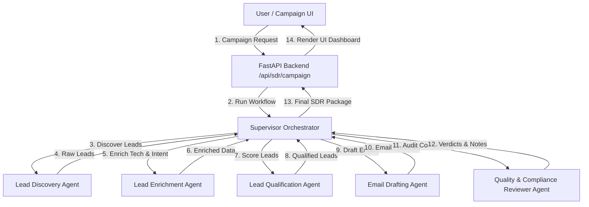
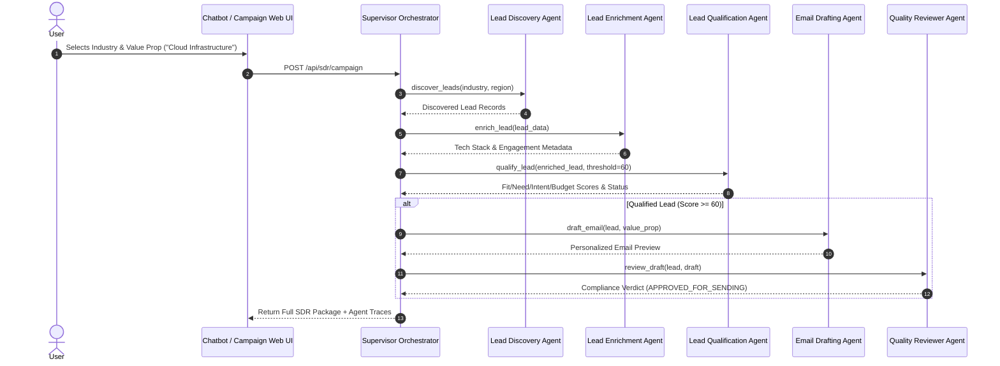
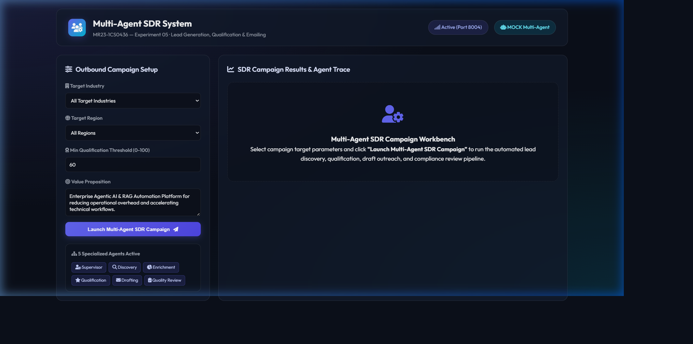
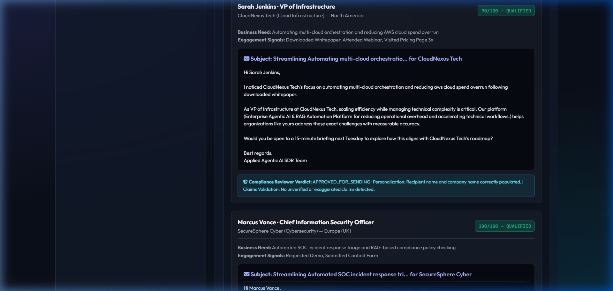

# Experiment 05 — Multi-Agent SDR System

**Course Code:** MR23-1CS0436
**Course Name:** Applied Agentic AI
**Laboratory:** Applied Agentic AI Laboratory
**Status:** ✅ Completed & Verified
**Directory:** `experiment-05-multi-agent-sdr`
**Port:** `8004`

---

## 🎯 A. Experiment Title
**Multi-Agent Sales Development Representative (SDR) System**

---

## 📚 B. Course Details
- **Course Code:** MR23-1CS0436
- **Course Name:** Applied Agentic AI
- **Laboratory:** Applied Agentic AI Laboratory
- **Module Type:** Multi-Agent Role Collaboration & Autonomous Outreach

---

## 📌 C. Status
✅ **Completed & Verified** (13 Automated Tests Passed, Runtime UI Verified on Port 8004)

---

## 🎯 D. Aim
To design, build, and evaluate an autonomous Multi-Agent SDR System comprising 5 specialized worker agents (Lead Discovery Agent, Lead Enrichment Agent, Lead Qualification Agent, Email Drafting Agent, and Quality & Compliance Reviewer Agent) coordinated by 1 Supervisor Orchestrator to automate B2B lead discovery, multi-dimensional scoring, draft outreach personalization, and compliance safety verification.

---

## 🎯 E. Learning Objectives
1. **Multi-Agent Architecture & Role Collaboration:** Implement a modular multi-agent system where specialized worker agents communicate via structured state contracts.
2. **Transparent Lead Qualification Scoring:** Develop a deterministic 4-dimensional scoring model (Fit, Need, Intent, Budget) to grade leads accurately.
3. **Safe Outbound Personalization:** Generate personalized cold outreach email drafts incorporating specific engagement signals and corporate value propositions without sending actual unsolicited emails.
4. **Automated Quality & Compliance Auditing:** Implement a dedicated reviewer agent to check email drafts for personalization, unverified claims, and B2B tone standards.

---

## 📜 F. Problem Statement
Manual B2B Sales Development Representative (SDR) workflows suffer from inconsistent lead scoring, time-consuming lead enrichment, generic cold outreach templates, and regulatory compliance risks. Single-agent LLM systems struggle to handle all tasks without hallucinating or skipping verification steps. A **Multi-Agent SDR System** decomposes the outreach pipeline into discrete, specialized role agents—discovering target leads, enriching tech stack metadata, calculating transparent qualification scores, drafting personalized emails, and auditing drafts for compliance before final approval.

---

## 💡 G. Multi-Agent System Concept Overview
The system features 5 specialized worker agents coordinated by 1 Supervisor Orchestrator:
1. **Supervisor Orchestrator:** Controls campaign execution, manages inter-agent state transitions, and records step timing traces.
2. **Lead Discovery Agent:** Filters synthetic B2B lead records based on target industry and region criteria.
3. **Lead Enrichment Agent:** Analyzes executive decision-maker roles, tech stack alignment, and engagement intensity.
4. **Lead Qualification Agent:** Calculates Fit (0-25), Need (0-25), Intent (0-25), and Budget (0-25) scores. Leads scoring $\ge 60/100$ are marked `QUALIFIED`.
5. **Email Drafting Agent:** Constructs tailored cold email previews incorporating specific business needs and value propositions.
6. **Quality & Compliance Reviewer Agent:** Audits drafts for personalization, claim validity, and professional tone (`APPROVED_FOR_SENDING` | `NEEDS_REVISION` | `REJECTED`).

---

## 🏗️ H. System Architecture



---

## 🔄 I. Multi-Agent Workflow Sequence



---

## 📁 J. Folder & File Structure

```
experiment-05-multi-agent-sdr/
├── README.md                           # Comprehensive Experiment Documentation
├── requirements.txt                    # Dependencies
├── .env.example                        # Config Template
├── data/
│   ├── seed_leads.py                   # Synthetic Lead Dataset Generator
│   └── leads.json                      # B2B Lead Dataset (6 records)
├── app/
│   ├── __init__.py
│   ├── main.py                         # FastAPI Router (Port 8004)
│   ├── config.py                       # Settings
│   ├── schemas.py                      # Pydantic Models
│   ├── services/
│   │   ├── __init__.py
│   │   ├── lead_discovery_agent.py     # Discovery Agent
│   │   ├── lead_enrichment_agent.py    # Enrichment Agent
│   │   ├── lead_qualification_agent.py # Qualification Scoring Agent
│   │   ├── email_drafting_agent.py     # Email Drafting Agent
│   │   ├── compliance_reviewer_agent.py# Compliance Reviewer Agent
│   │   └── sdr_supervisor.py           # Supervisor Orchestrator
│   └── static/                         # UI Assets (index.html, style.css, app.js)
├── tests/                              # 13 Automated PyTest Tests
└── screenshots/                        # 4 Verified Screenshot Artifacts
```

---

## 💻 K. Technology Stack
- **Python 3.10+**: Core Backend Runtime
- **FastAPI / Uvicorn**: Web Framework & ASGI Server (Port 8004)
- **Pydantic v2**: Data Validation & Schema Contracts
- **HTML5/CSS3/Vanilla JS**: Glassmorphic Campaign Workbench UI

---

## ⚙️ L. Installation & Setup

### Windows PowerShell:
```powershell
cd "D:\Agentic AI Experiments\experiment-05-multi-agent-sdr"
python -m venv venv
.\venv\Scripts\activate
pip install -r requirements.txt
Copy-Item .env.example .env
python data/seed_leads.py
```

### Linux / macOS:
```bash
cd "D:/Agentic AI Experiments/experiment-05-multi-agent-sdr"
python3 -m venv venv
source venv/bin/activate
pip install -r requirements.txt
cp .env.example .env
python3 data/seed_leads.py
```

---

## 🚀 M. Execution Procedure

```powershell
# Ensure virtual environment is active in PowerShell
.\venv\Scripts\activate

# Launch application server on port 8004
python -m app.main
```

#### Exact Browser URL
👉 **`http://127.0.0.1:8004`**

---

## 🖥️ N. How to Use the UI
1. **Header Bar:** Displays title *"Multi-Agent SDR System"*, status badge (`Port 8004`), and Agent Mode (`Mock Multi-Agent`).
2. **Campaign Control Panel:** Select target industry (e.g., *"Cloud Infrastructure"*), region, qualification threshold (e.g., `60`), and value proposition.
3. **Launch Action:** Click *"Launch Multi-Agent SDR Campaign"* to trigger the supervisor workflow.
4. **Metrics Summary Row:** View real-time cards for Discovered Leads, Qualified Leads, Drafted Outreaches, and Compliance Approved counts.
5. **Multi-Agent Execution Trace Card:** View chronological step cards detailing agent actions, inputs, outputs, and execution times.
6. **Outreach & Qualification Cards:** Inspect individual lead qualification scores (Fit, Need, Intent, Budget), generated email drafts, and compliance reviewer verdicts.

---

## ❓ O. Sample Inputs & Verification

- **Input 1:** Target Industry = *"Cloud Infrastructure"*, Threshold = `60`
  - **Result:** Sarah Jenkins (VP of Infrastructure, CloudNexus Tech) scored **90/100** (`QUALIFIED`). Email draft generated and `APPROVED_FOR_SENDING`.
- **Input 2:** Target Industry = *"EdTech"*, Threshold = `60`
  - **Result:** Rachel Adams (EduLearn Systems) scored **35/100** (`DISQUALIFIED`). No email draft generated.

---

## 🛡️ P. Safety & Compliance Controls
- **Safe Draft Only:** Generates email text previews only. **No actual unsolicited emails are delivered.**
- **Synthetic Data Standard:** Operates exclusively on synthetic educational B2B lead profiles in `data/leads.json`.
- **Automated Compliance Reviewer:** Audits drafts for recipient personalization and blocks unverified guarantee claims (e.g., *"guarantee 100%"*).

---

## 🧪 Q. Automated Testing
Run the PyTest test suite:
```powershell
python -m pytest tests
```
- **Verified Test Result:** **`13 passed in 0.50s`** (covers lead discovery, qualification scoring, draft generation, compliance auditing, supervisor workflow, and FastAPI endpoints).

---

## 🖼️ R. Screenshots & Visual Evidence

#### Screenshot 1 — Initial Dashboard

*Figure 5.1: Initial Web UI dashboard of the Multi-Agent SDR System showing campaign setup controls, active agent chips, and empty workbench.*

#### Screenshot 2 — Multi-Agent Execution Trace & Summary

*Figure 5.2: Campaign summary metrics row and chronological Multi-Agent Execution Trace timeline.*

#### Screenshot 3 — Lead Qualification & Outreach Preview

*Figure 5.3: Qualified lead card showing 90/100 score breakdown and personalized cold email preview.*

#### Screenshot 4 — Compliance Reviewer Verdict Box

*Figure 5.4: Quality & Compliance Reviewer Agent verdict box displaying APPROVED_FOR_SENDING verdict and audit notes.*

---

## ❓ S. Experiment 05 Viva Questions & Answers

1. **Q: What is the core objective of Experiment 05?**
   *A:* To design a Multi-Agent SDR system where specialized agents (Discovery, Enrichment, Qualification, Drafting, Compliance Reviewer) collaborate under a Supervisor Orchestrator to automate lead qualification and draft outreach safely.

2. **Q: How does a multi-agent system differ from a single-agent system?**
   *A:* A single-agent system handles all tasks in one prompt loop, risking hallucination. A multi-agent system decomposes complex workflows into specialized roles with distinct inputs, outputs, and validation steps.

3. **Q: What four dimensions are used in lead qualification scoring?**
   *A:* Fit (role & tech match), Need (business challenge urgency), Intent (engagement signals), and Budget (company budget band), totaling 100 points.

4. **Q: How is safety guaranteed in outbound email generation?**
   *A:* The system operates in safe preview mode (generating text drafts only) and uses synthetic lead data. No actual emails are sent over external SMTP/email services.

5. **Q: What role does the Quality & Compliance Reviewer Agent play?**
   *A:* It audits generated drafts to ensure explicit recipient personalization, absence of unverified guarantee claims, and proper B2B consultative tone before approving the draft.

6. **Q: What happens when a lead scores below the qualification threshold?**
   *A:* The Lead Qualification Agent marks the lead `DISQUALIFIED`, logging the score summary, and the Supervisor skips email drafting for that lead.

7. **Q: What is the default server port for Experiment 05?**
   *A:* Port `8004` (accessed via `http://127.0.0.1:8004`).

8. **Q: What structured information is exposed in the Multi-Agent Execution Trace?**
   *A:* Agent name, action type, description, inputs, outputs, step status, and execution duration in milliseconds.

9. **Q: How does the Supervisor Orchestrator manage state between agents?**
   *A:* The Supervisor passes structured Pydantic data objects (Lead, QualificationResult, EmailDraft) sequentially from one agent to the next.

10. **Q: How many automated tests cover Experiment 05?**
    *A:* 13 automated PyTest unit and integration tests covering discovery, qualification, drafting, compliance, supervisor orchestration, and API endpoints.

---

## 📝 T. Conclusion
Experiment 05 successfully demonstrates a Multi-Agent SDR System, proving that role specialization, transparent scoring, and automated compliance auditing significantly improve B2B outreach quality and safety.
