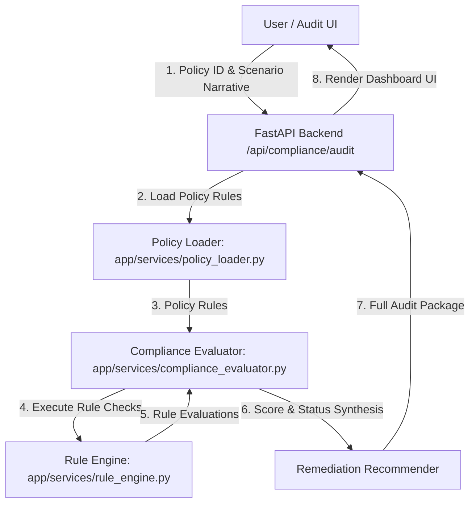
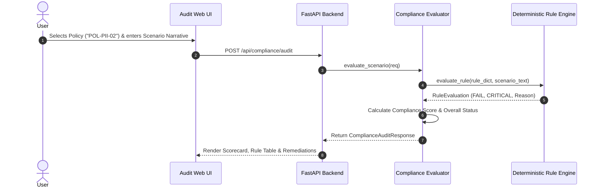
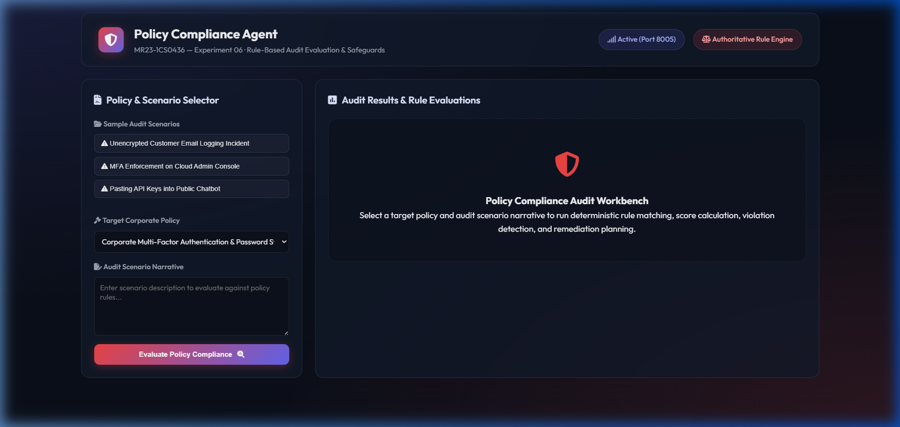
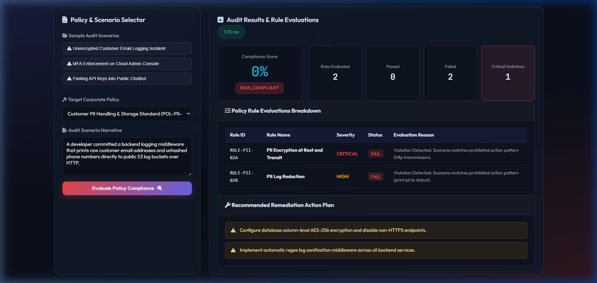

# Experiment 06 — Policy Compliance Agent

**Course Code:** MR23-1CS0436
**Course Name:** Applied Agentic AI
**Laboratory:** Applied Agentic AI Laboratory
**Status:** ✅ Completed & Verified
**Directory:** `experiment-06-policy-compliance`
**Port:** `8005`

---

## 🎯 A. Experiment Title
**Policy Compliance Agent with Deterministic Rule Evaluation**

---

## 📚 B. Course Details
- **Course Code:** MR23-1CS0436
- **Course Name:** Applied Agentic AI
- **Laboratory:** Applied Agentic AI Laboratory
- **Module Type:** Rule-Based Evaluation & Policy Safeguards

---

## 📌 C. Status
✅ **Completed & Verified** (11 Automated Tests Passed, Runtime UI Verified on Port 8005)

---

## 🎯 D. Aim
To design, build, and evaluate an automated Policy Compliance Agent equipped with an authoritative deterministic Rule Engine, evaluating synthetic audit scenario narratives against corporate IT, PII data protection, and Generative AI usage policies to calculate compliance scores, detect violations, and synthesize actionable remediation plans.

---

## 🎯 E. Learning Objectives
1. **Authoritative Rule Engine Architecture:** Implement a deterministic rule engine baseline to evaluate policy compliance rather than relying solely on non-deterministic LLM outputs.
2. **Multi-Dimensional Severity Scoring:** Classify policy rules into `CRITICAL`, `HIGH`, `MEDIUM`, and `LOW` severities, reducing overall compliance scores dynamically when critical violations occur.
3. **Structured Audit Evidence Trace:** Produce transparent audit logs containing rule IDs, matched keywords, detected prohibitions, evaluation status (`PASS` | `FAIL` | `WARNING`), and specific reasons.
4. **Actionable Remediation Generation:** Synthesize specific, prioritized technical remediation steps for non-compliant audit scenarios.

---

## 📜 F. Problem Statement
Manual policy compliance auditing across complex enterprise IT, cybersecurity, and data protection standards is slow, subjective, and prone to human oversight. Depending solely on unstructured LLM prompts for compliance verification introduces hallucination risks where serious violations are overlooked. A **Policy Compliance Agent** addresses this by combining an authoritative deterministic Rule Engine (for exact keyword/prohibition verification) with structured scoring, clear severity classification, and automated remediation synthesis.

---

## 💡 G. Policy & Rule Evaluation Concept Overview
The Compliance Agent processes scenarios through a 4-stage pipeline:
1. **Policy Loader:** Retrieves formal JSON policies containing rules, required keywords, prohibited actions, severity ratings, and default remediations.
2. **Deterministic Rule Engine:** Scans narrative text for prohibited keyword patterns and mandatory compliance controls.
3. **Compliance Evaluator:** Calculates Compliance Score (0-100), applies penalties for critical violations (-40%), and determines overall status (`COMPLIANT` | `WARNING` | `NON_COMPLIANT`).
4. **Remediation Recommender:** Aggregates unique remediation actions for failed rules to guide technical remediation.

---

## 🏗️ H. System Architecture



---

## 🔄 I. Policy Audit Workflow Sequence



---

## 📁 J. Folder & File Structure

```
experiment-06-policy-compliance/
├── README.md                           # Comprehensive Documentation
├── requirements.txt                    # Dependencies
├── .env.example                        # Config Template
├── data/
│   ├── seed_policies.py                # Synthetic Policy Dataset Generator
│   ├── policies.json                   # Policy Dataset (3 policies)
│   └── scenarios.json                  # Test Audit Scenarios (3 scenarios)
├── app/
│   ├── __init__.py
│   ├── main.py                         # FastAPI Server Router (Port 8005)
│   ├── config.py                       # Settings
│   ├── schemas.py                      # Pydantic Schemas
│   ├── services/
│   │   ├── __init__.py
│   │   ├── policy_loader.py            # Policy Data Loader
│   │   ├── rule_engine.py              # Authoritative Rule Engine
│   │   └── compliance_evaluator.py     # Score & Status Evaluator
│   └── static/                         # UI Assets (index.html, style.css, app.js)
├── tests/                              # 11 Automated PyTest Tests
└── screenshots/                        # 4 Verified Screenshot Artifacts
```

---

## 💻 K. Technology Stack
- **Python 3.10+**: Core Backend Language
- **FastAPI / Uvicorn**: Web Framework & ASGI Server (Port 8005)
- **Pydantic v2**: Data Schemas & Validation
- **HTML5/CSS3/Vanilla JS**: Glassmorphic Audit Workbench UI

---

## ⚙️ L. Installation & Setup

### Windows PowerShell:
```powershell
cd "D:\Agentic AI Experiments\experiment-06-policy-compliance"
python -m venv venv
.\venv\Scripts\activate
pip install -r requirements.txt
Copy-Item .env.example .env
python data/seed_policies.py
```

### Linux / macOS:
```bash
cd "D:/Agentic AI Experiments/experiment-06-policy-compliance"
python3 -m venv venv
source venv/bin/activate
pip install -r requirements.txt
cp .env.example .env
python3 data/seed_policies.py
```

---

## 🚀 M. Execution Procedure

```powershell
# Ensure virtual environment is active in PowerShell
.\venv\Scripts\activate

# Launch application server on port 8005
python -m app.main
```

#### Exact Browser URL
👉 **`http://127.0.0.1:8005`**

---

## 🖥️ N. How to Use the UI
1. **Header Panel:** Displays title *"Policy Compliance Agent"*, status badge (`Port 8005`), and Engine mode (`Authoritative Rule Engine`).
2. **Sample Audit Scenarios:** Click quick scenario chips (e.g., *"Unencrypted Customer Email Logging Incident"*, *"MFA Enforcement on Cloud Admin Console"*, *"Pasting API Keys into Public Chatbot"*).
3. **Audit Controls:** Select target policy from dropdown and edit scenario text narrative.
4. **Evaluate Action:** Click *"Evaluate Policy Compliance"* to execute deterministic rule matching.
5. **Scorecard Header:** View Compliance Score percentage (`0%` for total failure, `10%` for 1/2 passed with critical violation), overall status pill (`NON_COMPLIANT`), rules evaluated breakdown, and critical violation counters.
6. **Policy Rule Evaluations Table:** Review rule-by-rule statuses (`PASS` | `FAIL`), severities, and detailed evaluation reasons.
7. **Recommended Remediation Plan:** View prioritized technical remediation instructions for failed policy controls.

---

## ❓ O. Sample Inputs & Verification

- **Scenario 1 (Non-Compliant PII Logging):**
  - **Policy:** `POL-PII-02` (Customer PII Handling Standard)
  - **Scenario:** *"Developer printed raw customer email addresses and unencrypted PII directly to public S3 logs via HTTP transmission."*
  - **Result:** Passed = 0/2 (0%), Critical Violations = 1 -> Score = **0%**, Status = `NON_COMPLIANT`.
- **Scenario 2 (Partial Compliance with Critical Violation):**
  - **Policy:** `POL-PII-02` (Customer PII Handling Standard)
  - **Scenario:** *"Middleware applies log sanitization masking, but transmits data over HTTP."*
  - **Result:** Passed = 1/2 (Raw Score 50%), Critical Penalty (-40%) -> Score = **10%**, Status = `NON_COMPLIANT`.
- **Scenario 3 (Compliant MFA Setup):**
  - **Policy:** `POL-SEC-01` (Multi-Factor Authentication Standard)
  - **Scenario:** *"DevOps team enforced MFA 2FA hardware security keys on all remote VPN access portals with complex passphrases."*
  - **Result:** Passed = 2/2 (100%), Critical Violations = 0 -> Score = **100%**, Status = `COMPLIANT`.

---

## 🛡️ P. Safety & Security Controls
- **Deterministic Rule Baseline:** Compliance verdicts are calculated deterministically by evaluating exact policy rule keywords and prohibited action patterns.
- **Synthetic Educational Datasets:** Operates on synthetic policy files (`data/policies.json`). No actual corporate network credentials or customer PII are logged or processed.

---

## 🧪 Q. Automated Testing
Run PyTest test suite:
```powershell
python -m pytest tests
```
- **Verified Test Result:** **`11 passed in 0.91s`** (covers policy loading, rule matching, critical score penalties, compliant scenarios, non-compliant scenarios, and FastAPI endpoints).

---

## 🖼️ R. Screenshots & Visual Evidence

#### Screenshot 1 — Initial Audit Dashboard

*Figure 6.1: Initial Web UI dashboard of the Policy Compliance Agent showing scenario controls and empty workbench.*

#### Screenshot 2 — Compliance Audit Scorecard

*Figure 6.2: Compliance Scorecard header showing 10% score, NON_COMPLIANT overall status pill, and critical violation counter.*

#### Screenshot 3 — Policy Rule Breakdown Table

*Figure 6.3: Policy Rule Breakdown table displaying rule IDs, names, severities, PASS/FAIL badges, and evaluation reasons.*

#### Screenshot 4 — Recommended Remediation Action Plan

*Figure 6.4: Recommended Remediation Action Plan box displaying prioritized remediation instructions.*

---

## ❓ S. Experiment 06 Viva Questions & Answers

1. **Q: What is the primary objective of Experiment 06?**
   *A:* To build an automated Policy Compliance Agent using an authoritative deterministic Rule Engine to evaluate scenario narratives against formal IT/cybersecurity policies and generate audit reports with remediations.

2. **Q: Why is a deterministic rule engine preferred over pure LLM text generation for compliance?**
   *A:* Pure LLM generation introduces hallucination and inconsistent enforcement risks. A deterministic rule engine guarantees exact keyword and prohibition matching as the authoritative compliance baseline.

3. **Q: How are policy rules structured in the system?**
   *A:* Each rule specifies a unique `rule_id`, name, description, required keywords, prohibited actions, severity (`CRITICAL`, `HIGH`, `MEDIUM`, `LOW`), and remediation guidance.

4. **Q: How is the Compliance Score calculated?**
   *A:* Score equals $(\text{Passed Rules} / \text{Total Rules}) \times 100$. If one or more `CRITICAL` severity rules fail, a mandatory 40-point penalty is deducted.

5. **Q: What overall status categories can an audit yield?**
   *A:* `COMPLIANT` (Score $\ge 80$, 0 fails), `WARNING` (Score 50-79, 0 critical fails), and `NON_COMPLIANT` (Score $< 50$ or $\ge 1$ critical fail).

6. **Q: How does the system handle missing evidence in scenario descriptions?**
   *A:* If a scenario narrative lacks explicit proof of mandatory controls without matching prohibited keywords, the rule engine assigns a `WARNING` status.

7. **Q: What default server port is reserved for Experiment 06?**
   *A:* Port `8005` (accessed via `http://127.0.0.1:8005`).

8. **Q: What information is included in the audit trace?**
   *A:* Step numbers, stage names (`POLICY_LOAD`, `RULE_ENGINE_EVALUATION`, `REMEDIATION_SYNTHESIS`), detailed descriptions, and execution durations in milliseconds.

9. **Q: How are remediations provided to the end-user?**
   *A:* The Remediation Recommender aggregates unique remediation guidance strings for all failed rules, presenting a prioritized technical action plan.

10. **Q: How many automated tests cover Experiment 06?**
    *A:* 11 automated PyTest unit and integration tests covering policy loading, rule matching, score calculation, non-compliant detection, and FastAPI endpoints.

---

## 📝 T. Conclusion
Experiment 06 successfully demonstrates a Policy Compliance Agent, proving that combining an authoritative deterministic Rule Engine with clear severity scoring produces transparent, reproducible, and audit-ready compliance evaluations.
