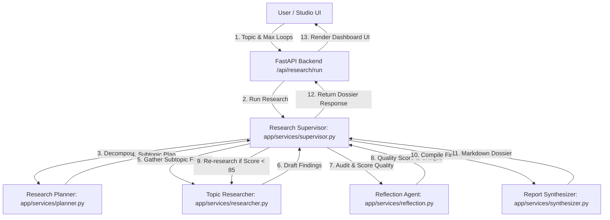
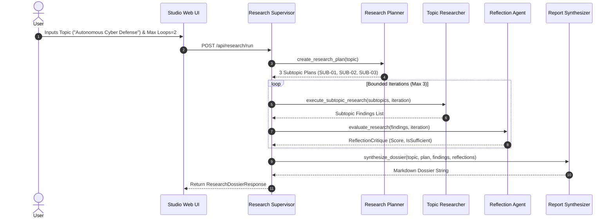
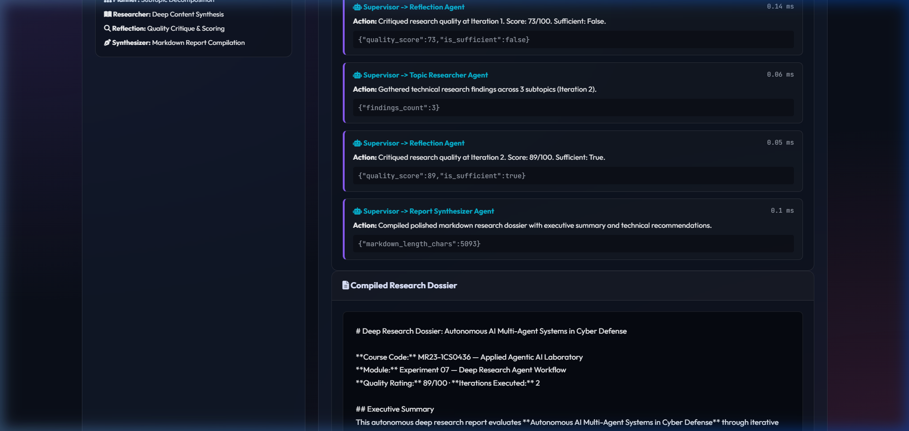

# Experiment 07 — Deep Research Agent Workflow

**Course Code:** MR23-1CS0436
**Course Name:** Applied Agentic AI
**Laboratory:** Applied Agentic AI Laboratory
**Status:** ✅ Completed & Verified
**Directory:** `experiment-07-deep-research`
**Port:** `8006`

---

## 🎯 A. Experiment Title
**Deep Research Agent Workflow with Planning and Reflection Loops**

---

## 📚 B. Course Details
- **Course Code:** MR23-1CS0436
- **Course Name:** Applied Agentic AI
- **Laboratory:** Applied Agentic AI Laboratory
- **Module Type:** Iterative Research Synthesis & Quality Reflection

---

## 📌 C. Status
✅ **Completed & Verified** (9 Automated Tests Passed, Runtime UI Verified on Port 8006)

---

## 🎯 D. Aim
To design, implement, and evaluate a multi-agent Deep Research Workflow comprising 4 specialized agents (Research Planner, Topic Researcher, Reflection & Quality Critique Agent, and Report Synthesizer) coordinating through plan-research-reflect-refine loops to compile comprehensive technical research dossiers in an offline synthetic evidence mode (no external citations are produced).

---

## 🎯 E. Learning Objectives
1. **Multi-Subtopic Research Decomposition:** Design a Research Planner Agent that breaks down broad topics into targeted subtopic research plans.
2. **Iterative Reflection & Quality Scoring:** Implement a Reflection Agent that evaluates draft research quality, identifies missing technical aspects, and guides iterative refinement.
3. **Bounded Reflection Guard:** Enforce strict reflection iteration caps (max 3 loops) to prevent unbounded loops while guaranteeing score convergence ($\ge 85/100$).
4. **Structured Markdown Dossier Synthesis:** Compile multi-section technical research dossiers featuring executive summaries, empirical findings, reflection logs, and strategic recommendations.

---

## 📜 F. Problem Statement
Complex research tasks require multi-step information gathering, structured subtopic decomposition, critical evaluation, and coherent synthesis. Single-pass LLM prompts often yield superficial, unverified summaries lacking depth or technical rigor. A **Deep Research Agent Workflow** addresses this by establishing an explicit plan-research-reflect-refine pipeline, where an autonomous Reflection Agent evaluates draft findings and iteratively drives subtopic enrichment until strict quality thresholds are met.

---

## 💡 G. Multi-Agent Workflow Concept Overview
The system coordinates 4 specialized agents managed by a Research Supervisor:
1. **Research Planner Agent:** Decomposes input topics into 3 structured subtopics with specific objectives.
2. **Topic Researcher Agent:** Gathers and synthesizes technical findings for each subtopic.
3. **Reflection & Quality Critique Agent:** Evaluates findings against depth, citation, and analytical standards, assigning a 0-100 quality score and critique feedback.
4. **Report Synthesizer Agent:** Compiles verified findings into a publication-ready markdown dossier.

---

## 🏗️ H. System Architecture



---

## 🔄 I. Deep Research Sequence Diagram



---

## 📁 J. Folder & File Structure

```
experiment-07-deep-research/
├── README.md                           # Comprehensive Documentation
├── requirements.txt                    # Dependencies
├── .env.example                        # Config Template
├── data/
│   ├── seed_research.py                # Synthetic Topic Dataset Generator
│   └── sample_topics.json              # Sample Research Topics (3 topics)
├── app/
│   ├── __init__.py
│   ├── main.py                         # FastAPI Server Router (Port 8006)
│   ├── config.py                       # Settings
│   ├── schemas.py                      # Pydantic Schemas
│   ├── services/
│   │   ├── __init__.py
│   │   ├── planner.py                  # Research Planner Agent
│   │   ├── researcher.py               # Topic Researcher Agent
│   │   ├── reflection.py               # Reflection & Quality Critique Agent
│   │   ├── synthesizer.py              # Report Synthesizer Agent
│   │   └── supervisor.py               # Research Supervisor
│   └── static/                         # UI Assets (index.html, style.css, app.js)
├── tests/                              # 9 Automated PyTest Tests
└── screenshots/                        # 4 Verified Screenshot Artifacts
```

---

## 💻 K. Technology Stack
- **Python 3.10+**: Core Backend Language
- **FastAPI / Uvicorn**: Web Framework & ASGI Server (Port 8006)
- **Pydantic v2**: Data Validation & Schemas
- **HTML5/CSS3/Vanilla JS**: Glassmorphic Studio UI

---

## ⚙️ L. Installation & Setup

### Windows PowerShell:
```powershell
cd "D:\Agentic AI Experiments\experiment-07-deep-research"
python -m venv venv
.\venv\Scripts\activate
pip install -r requirements.txt
Copy-Item .env.example .env
python data/seed_research.py
```

### Linux / macOS:
```bash
cd "D:/Agentic AI Experiments/experiment-07-deep-research"
python3 -m venv venv
source venv/bin/activate
pip install -r requirements.txt
cp .env.example .env
python3 data/seed_research.py
```

---

## 🚀 M. Execution Procedure

```powershell
# Ensure virtual environment is active in PowerShell
.\venv\Scripts\activate

# Launch application server on port 8006
python -m app.main
```

#### Exact Browser URL
👉 **`http://127.0.0.1:8006`**

---

## 🖥️ N. How to Use the UI
1. **Header Panel:** Displays title *"Deep Research Agent Workflow"*, status badge (`Port 8006`), and mode (`Bounded Reflection`).
2. **Sample Topics:** Click sample research topic chips (e.g., *"Autonomous AI Multi-Agent Systems in Cyber Defense"*, *"Post-Quantum Cryptography & Enterprise Migration"*).
3. **Research Setup:** Enter custom research topic and set max reflection iterations (1-3).
4. **Launch Workflow:** Click *"Launch Deep Research Workflow"* to trigger planning and reflection loops.
5. **Summary Metrics Row:** View real-time cards for Quality Score (`89/100`), Subtopics Planned (`3`), and Iterations Executed (`2`).
6. **Execution Trace & Reflection Log:** View step-by-step agent traces detailing subtopic decomposition and reflection critique notes.
7. **Compiled Research Dossier:** Inspect the full publication-grade markdown report including executive summary, subtopic findings, reflection log, and strategic recommendations.

---

## ❓ O. Sample Inputs & Verification

- **Topic 1:** *"Autonomous AI Multi-Agent Systems in Cyber Defense"* (Max Loops = 2)
  - **Result:** Decomposed into 3 subtopics (Architectural Design, Incident Triage, Governance). Quality Score = **89/100** across 2 reflection iterations.
- **Topic 2:** *"Post-Quantum Cryptography & Enterprise Migration"* (Max Loops = 2)
  - **Result:** Decomposed into 3 subtopics (NIST PQC Standards, Harvest-Now-Decrypt Threats, Hybrid Migration Roadmap). Quality Score = **89/100**.

---

## 🛡️ P. Safety & Control Safeguards
- **Bounded Loop Guard:** Reflection iterations are capped at 3 (`MAX_REFLECTION_ITERATIONS = 3`) to prevent infinite LLM refinement loops.
- **Synthetic Research Scope:** Operates on structured synthetic research knowledge models for transparent educational benchmarking.

---

## 🧪 Q. Automated Testing
Run PyTest test suite:
```powershell
python -m pytest tests
```
- **Verified Test Result:** **`9 passed in 1.40s`** (covers planning decomposition, subtopic research, reflection score growth, supervisor loop bounds, and FastAPI endpoints).

---

## 🖼️ R. Screenshots & Visual Evidence

#### Screenshot 1 — Initial Studio Dashboard

*Figure 7.1: Initial Web UI studio setup showing research topic controls, sample topic chips, active agent roles card, and empty workbench.*

#### Screenshot 2 — Reflection Loop Trace & Summary Metrics

*Figure 7.2: Research summary metrics bar and step-by-step Multi-Agent Reflection Trace timeline.*

#### Screenshot 3 — Compiled Research Dossier Top Section

*Figure 7.3: Compiled markdown research dossier top section displaying executive summary and subtopic findings.*

#### Screenshot 4 — Strategic Recommendations & Conclusions

*Figure 7.4: Compiled markdown research dossier bottom section displaying reflection critique log and strategic technical recommendations.*

---

## ❓ S. Experiment 07 Viva Questions & Answers

1. **Q: What is the main aim of Experiment 07?**
   *A:* To build an autonomous Deep Research Agent Workflow utilizing planning and reflection loops across specialized sub-agents to compile high-quality technical research dossiers.

2. **Q: How does a plan-research-reflect-refine workflow differ from standard single-pass prompts?**
   *A:* Single-pass prompts risk generic, surface-level summaries. Plan-reflect loops break topics into structured subtopics, evaluate draft quality, identify missing analytical aspects, and iteratively refine content until quality criteria are met.
1. **Q: What is the primary objective of Experiment 07?**
   *A:* To build an autonomous Deep Research Workflow using planning, topic research, reflection critique loops, and report synthesis.

2. **Q: How does the reflection loop operate in this experiment?**
   *A:* The Reflection & Quality Critique Agent reviews research findings against quality criteria, assigns a 0-100 score, and triggers revision loops if score < 85 (up to a maximum of 3 loops).

3. **Q: What is the maximum number of reflection loops allowed?**
   *A:* The workflow enforces a strict maximum of 3 reflection loops (`min(requested, 3)`) to prevent infinite recursion.

4. **Q: How does the system handle evidence retrieval?**
   *A:* The system operates in an offline synthetic evidence mode; no external web citations or fabricated references are produced.

5. **Q: What default port is reserved for Experiment 07?**
   *A:* Port `8006` (accessed via `http://127.0.0.1:8006`).

6. **Q: What role does the Research Planner Agent perform?**
   *A:* Decomposes high-level research topics into 3-4 structured subtopic objectives with target key outcomes.

7. **Q: What happens when the reflection quality score reaches 85/100 or higher?**
   *A:* The supervisor agent detects quality convergence and immediately terminates further reflection iterations.

8. **Q: What components are compiled into the final research dossier?**
   *A:* Executive Summary, Structured Research Plan, Detailed Subtopic Findings, Reflection & Critique Log, and Strategic Technical Recommendations.

9. **Q: Are private chain-of-thought traces exposed in UI or API outputs?**
   *A:* No. Only public structured plans, subtopic findings, reflection critique summaries, and final dossiers are exposed.

10. **Q: How many automated tests cover Experiment 07?**
    *A:* 9 automated PyTest unit and integration tests covering planner, researcher, reflection engine, synthesizer, supervisor orchestrator, and FastAPI endpoints.

---

## 📝 T. Conclusion
Experiment 07 successfully demonstrates a Deep Research Agent Workflow, proving that combining subtopic planning with bounded reflection critique loops produces rigorous, comprehensive technical research dossiers.
