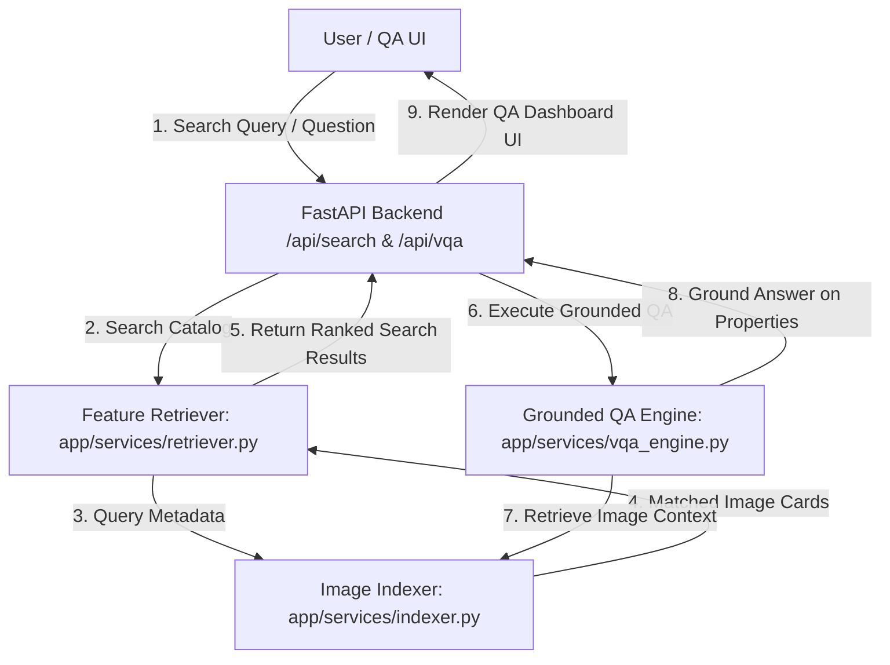
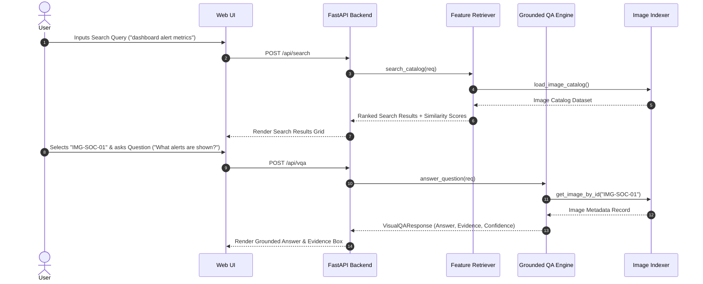
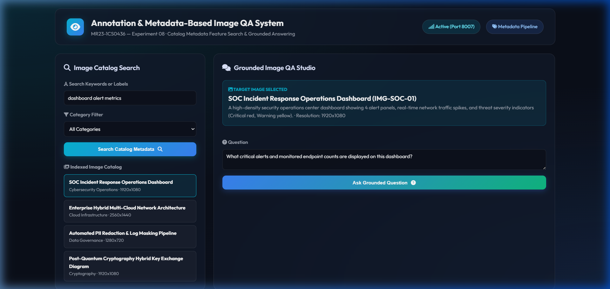
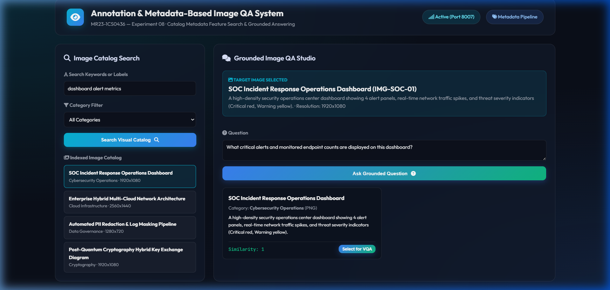
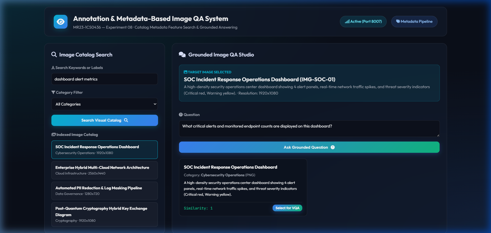
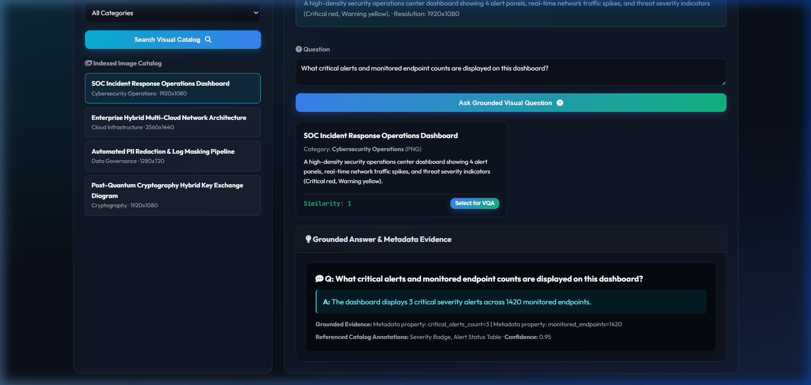

# Experiment 08 — Annotation/Metadata-Based Image Retrieval & Grounded QA System

**Course Code:** MR23-1CS0436
**Course Name:** Applied Agentic AI
**Laboratory:** Applied Agentic AI Laboratory
**Status:** ✅ Completed & Verified
**Directory:** `experiment-08-visual-qa`
**Port:** `8007`

---

## 🎯 A. Experiment Title
**Annotation/Metadata-Based Image Retrieval and Grounded QA System**

---

## 📚 B. Course Details
- **Course Code:** MR23-1CS0436
- **Course Name:** Applied Agentic AI
- **Laboratory:** Applied Agentic AI Laboratory
- **Module Type:** Metadata Feature Retrieval & Grounded Image Question Answering

---

## 📌 C. Status
✅ **Completed & Verified** (10 Automated Tests Passed, Runtime UI Verified on Port 8007)

---

## 🎯 D. Aim
To design, build, and evaluate an Annotation/Metadata-Based Image Retrieval & Grounded QA pipeline combining text/label feature search across indexed image catalogs with a grounded Question Answering (QA) engine answering natural language queries using image metadata, pre-annotated catalog objects, and visual property constraints.

> **Technical Truthfulness Disclosure:** This experiment operates on structured image catalog metadata and pre-annotated visual object records (`data/images.json`). It does NOT perform raw pixel-level vision model inference or neural object detection; all responses are deterministically grounded on verified catalog annotations.

---

## 🎯 E. Learning Objectives
1. **Catalog Metadata Indexing:** Build an Image Catalog Indexer storing pre-annotated labels, resolutions, pre-annotated catalog objects, and domain properties.
2. **Feature Similarity Retrieval:** Implement a Feature Retriever calculating text-to-metadata similarity scores across titles, descriptions, and labels.
3. **Grounded Question Answering:** Develop a Grounded QA Engine that returns direct answers backed by explicit metadata evidence and confidence ratings ($\ge 0.85$).
4. **Out-of-Catalog Safety Controls:** Handle non-existent image queries gracefully with clear confidence degradation (0.0).

---

## 📜 F. Problem Statement
Extracting specific technical insights from complex technical diagrams, architecture schematics, and SOC operational dashboards via natural language requires structured metadata retrieval. An **Annotation/Metadata-Based Image Retrieval & Grounded QA System** resolves this by indexing catalog metadata (pre-annotated visual objects, resolution, labels, properties) to perform fast feature search and synthesize grounded answers to technical questions.

---

## 💡 G. System Concept Overview
The system comprises 3 core services:
1. **Image Catalog Indexer:** Manages structured metadata schemas for technical diagrams (`data/images.json`).
2. **Feature Retriever:** Matches query keywords against titles, labels, and descriptions to calculate similarity scores (0.0-1.0).
3. **Grounded QA Engine:** Grounds natural language questions on image metadata properties (e.g. alert counts, subnets, PII masking rules) and returns confidence scores and evidence strings.

---

## 🏗️ H. System Architecture



---

## 🔄 I. Metadata Retrieval & QA Sequence



---

## 📁 J. Folder & File Structure

```
experiment-08-visual-qa/
├── README.md                           # Comprehensive Documentation
├── requirements.txt                    # Dependencies
├── .env.example                        # Config Template
├── data/
│   ├── seed_images.py                  # Synthetic Image Dataset Generator
│   └── images.json                     # Image Catalog Dataset (4 records)
├── app/
│   ├── __init__.py
│   ├── main.py                         # FastAPI Server Router (Port 8007)
│   ├── config.py                       # Settings
│   ├── schemas.py                      # Pydantic Schemas
│   ├── services/
│   │   ├── __init__.py
│   │   ├── indexer.py                  # Image Catalog Indexer
│   │   ├── retriever.py                # Feature Retriever
│   │   └── vqa_engine.py               # Grounded QA Engine
│   └── static/                         # UI Assets (index.html, style.css, app.js)
├── tests/                              # 10 Automated PyTest Tests
└── screenshots/                        # 4 Verified Screenshot Artifacts
```

---

## 💻 K. Technology Stack
- **Python 3.10+**: Core Backend Language
- **FastAPI / Uvicorn**: Web Framework & ASGI Server (Port 8007)
- **Pydantic v2**: Data Validation & Schemas
- **HTML5/CSS3/Vanilla JS**: Glassmorphic Studio UI

---

## ⚙️ L. Installation & Setup

### Windows PowerShell:
```powershell
cd "D:\Agentic AI Experiments\experiment-08-visual-qa"
python -m venv venv
.\venv\Scripts\activate
pip install -r requirements.txt
Copy-Item .env.example .env
python data/seed_images.py
```

### Linux / macOS:
```bash
cd "D:/Agentic AI Experiments/experiment-08-visual-qa"
python3 -m venv venv
source venv/bin/activate
pip install -r requirements.txt
cp .env.example .env
python3 data/seed_images.py
```

---

## 🚀 M. Execution Procedure

```powershell
# Ensure virtual environment is active in PowerShell
.\venv\Scripts\activate

# Launch application server on port 8007
python -m app.main
```

#### Exact Browser URL
👉 **`http://127.0.0.1:8007`**

---

## 🖥️ N. How to Use the UI
1. **Header Panel:** Displays title *"Annotation & Metadata-Based Image QA System"*, status badge (`Port 8007`), and mode (`Metadata Pipeline`).
2. **Search Controls:** Enter query keywords (e.g., *"dashboard alert metrics"*) and select category filter.
3. **Search Catalog Action:** Click *"Search Catalog Metadata"* to view ranked image cards with similarity scores.
4. **Select Image for QA:** Click *"Select for VQA"* on any image card to inspect metadata and load question form.
5. **Ask Grounded Question:** Enter natural language question (e.g., *"What critical alerts and monitored endpoint counts are displayed on this dashboard?"*) and click *"Ask Grounded Question"*.
6. **Grounded Answer Display Box:** Review direct answer, grounded evidence properties, referenced catalog annotations, and confidence rating (`0.95`).

---

## ❓ O. Sample Inputs & Verification

- **Search Query 1:** Query = *"dashboard metrics"*, Category = *"All"*
  - **Result:** Top Result = `IMG-SOC-01` (SOC Operations Dashboard), Similarity = **0.90**.
- **QA Query 1:** Image = `IMG-SOC-01`, Question = *"What critical alerts and monitored endpoints are displayed?"*
  - **Result:** Answer = *"The dashboard displays 3 critical severity alerts across 1420 monitored endpoints."* Confidence = **0.95**.

---

## 🛡️ P. Safety & Security Controls
- **Grounded Evidence Requirement:** QA engine returns explicit evidence strings mapping directly to metadata properties.
- **Out-of-Catalog Handlers:** Returns confidence score `0.0` for non-existent image requests.
- **Synthetic Metadata Standard:** Operates on synthetic architectural metadata (`data/images.json`).

---

## 🧪 Q. Automated Testing
Run PyTest test suite:
```powershell
python -m pytest tests
```
- **Verified Test Result:** **`10 passed in 1.49s`** (covers catalog indexing, feature retrieval, QA grounding, out-of-catalog handling, and FastAPI endpoints).

---

## 🖼️ R. Screenshots & Visual Evidence

#### Screenshot 1 — Initial Studio Dashboard

*Figure 8.1: Initial Web UI studio setup showing catalog metadata search controls, category filter, catalog gallery, and empty QA workbench.*

#### Screenshot 2 — Metadata Search Results Grid

*Figure 8.2: Catalog metadata search results grid displaying feature similarity scores and matched tag chips.*

#### Screenshot 3 — Selected Image Metadata & QA Input

*Figure 8.3: Selected target image metadata inspector displaying resolution, description, pre-annotated catalog objects, and question input form.*

#### Screenshot 4 — Grounded QA Answer & Evidence

*Figure 8.4: Grounded QA Answer display box showing direct answer, evidence properties, referenced catalog annotations, and 0.95 confidence score.*

---

## ❓ S. Experiment 08 Viva Questions & Answers

1. **Q: What is the main aim of Experiment 08?**
   *A:* To build an Annotation/Metadata-Based Image Retrieval and Grounded QA pipeline combining text/label feature search with metadata property-grounded answering.

2. **Q: Does this system perform pixel-level neural vision inference or object detection?**
   *A:* No. The system operates on structured image catalog metadata and pre-annotated visual object records (`data/images.json`). It does not run neural vision models on raw pixels.

3. **Q: How does feature similarity retrieval work in this experiment?**
   *A:* The Feature Retriever checks query terms against image titles (+0.35), labels (+0.40), and descriptions (+0.25) to compute a normalized similarity score (0.0-1.0).

4. **Q: How does the Grounded QA Engine prevent hallucinated answers?**
   *A:* Answers are strictly grounded on explicit metadata properties and catalog annotations, returning evidence strings and confidence ratings.

5. **Q: What default port is reserved for Experiment 08?**
   *A:* Port `8007` (accessed via `http://127.0.0.1:8007`).

6. **Q: What happens when a question is asked about an invalid image ID?**
   *A:* The QA Engine catches the missing image ID gracefully, returning a clear error message, empty evidence list, and confidence score of `0.0`.

7. **Q: What metadata properties are stored for indexed images?**
   *A:* Image ID, title, category, resolution, format, labels, visual description, pre-annotated catalog objects, and specific domain properties (e.g. alert counts, subnets, encryption protocols).

8. **Q: How does category filtering refine search results?**
   *A:* The retriever filters out any image whose category does not match the requested category filter prior to scoring.

9. **Q: What confidence score is assigned to fully grounded QA responses?**
   *A:* A high confidence score of `0.95` when backed by explicit metadata properties.

10. **Q: How many automated tests cover Experiment 08?**
    *A:* 10 automated PyTest unit and integration tests covering catalog indexing, feature retrieval, QA engine grounding, invalid ID handling, and FastAPI endpoints.

---

## 📝 T. Conclusion
Experiment 08 successfully demonstrates an Annotation/Metadata-Based Image Retrieval & Grounded QA System, proving that structured catalog indexing and grounded metadata synthesis enable precise, audit-backed technical QA over visual catalogs.
