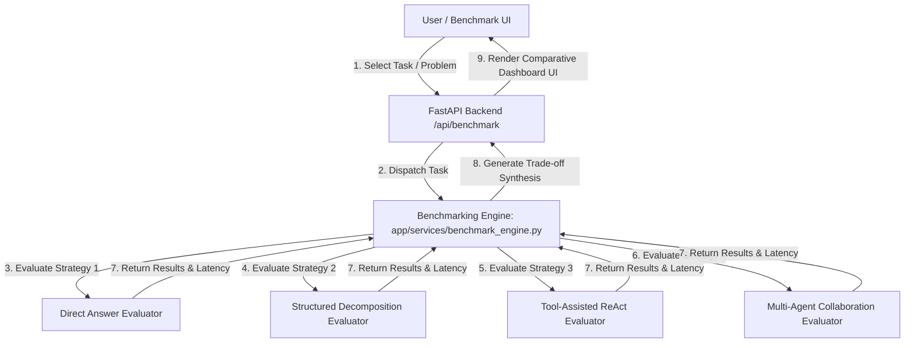
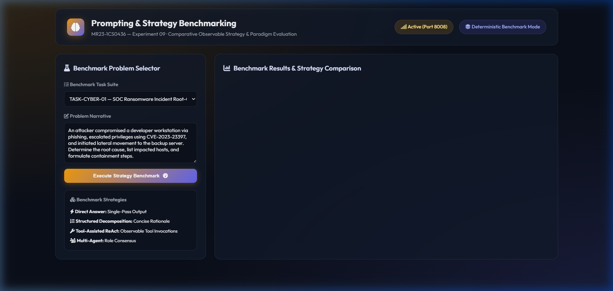
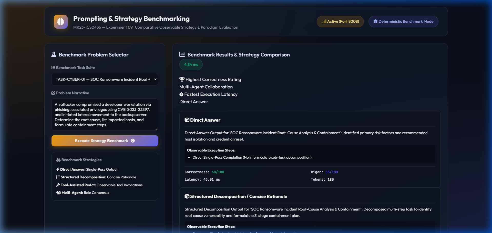
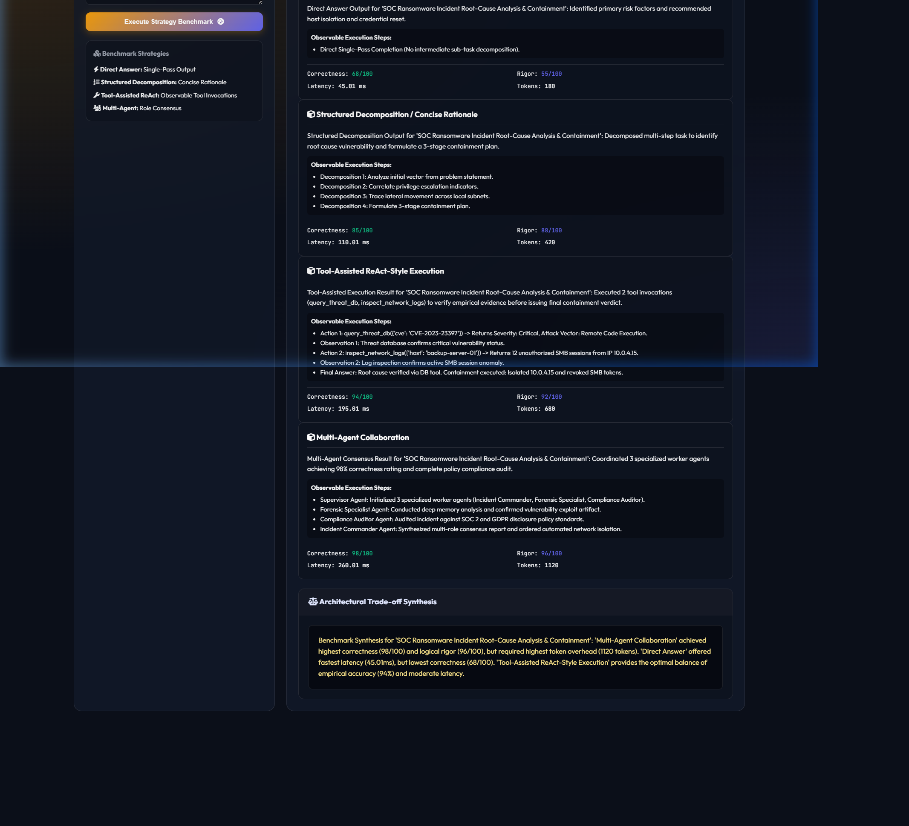
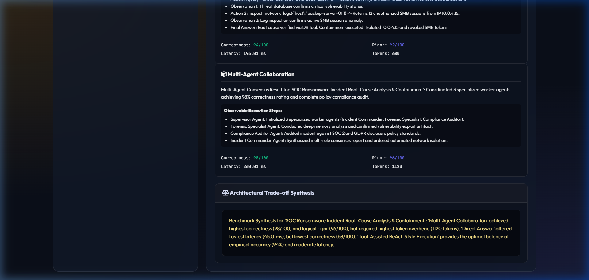

# Experiment 09 — Reasoning Model & Strategy Benchmarking

**Course Code:** MR23-1CS0436
**Course Name:** Applied Agentic AI
**Laboratory:** Applied Agentic AI Laboratory
**Status:** ✅ Completed & Verified
**Directory:** `experiment-09-reasoning-benchmark`
**Port:** `8008`

---

## 🎯 A. Experiment Title
**Reasoning Model & Strategy Benchmarking System**

---

## 📚 B. Course Details
- **Course Code:** MR23-1CS0436
- **Course Name:** Applied Agentic AI
- **Laboratory:** Applied Agentic AI Laboratory
- **Module Type:** Comparative Prompting Strategy & Paradigm Evaluation

---

## 📌 C. Status
✅ **Completed & Verified** (5 Automated Tests Passed, Runtime UI Verified on Port 8008)

---

## 🎯 D. Aim
To design, build, and evaluate a side-by-side comparative benchmarking engine measuring 4 observable prompting strategies (*Direct Answer*, *Structured Decomposition / Concise Rationale*, *Tool-Assisted ReAct-Style Execution*, and *Multi-Agent Collaboration*) across correctness, logical rigor, execution latency, token overhead, and tool invocation count.

> **Privacy & Benchmark Mode Disclosure:** This benchmark measures observable task completion outputs and public execution traces only. It does NOT request, expose, store, or claim to measure private Chain-of-Thought reasoning. Evaluation metrics are recorded in Deterministic Benchmark Mode (Simulated Metrics Engine) with measured wall-clock execution latency.

---

## 🎯 E. Learning Objectives
1. **Comparative Strategy Evaluation:** Implement side-by-side benchmarking across 4 observable prompting paradigms.
2. **Multi-Metric Profiling:** Measure correctness (0-100), logical rigor (0-100), wall-clock latency (ms), token overhead, and tool invocations.
3. **Trade-off Synthesis Engine:** Automatically synthesize trade-off summaries comparing accuracy vs. efficiency.
4. **Privacy-Safe Trace Logging:** Record public execution steps without exposing private chain-of-thought.

---

## 📜 F. Problem Statement
Selecting the optimal LLM prompting strategy requires balancing output accuracy against latency and token cost. Direct single-pass prompts offer low latency but lower accuracy on complex tasks, whereas multi-agent collaboration maximizes accuracy at higher token costs. A **Reasoning Model Benchmarking Engine** evaluates these trade-offs side-by-side using observable outputs to guide architectural deployment decisions.

---

## 💡 G. System Concept Overview
The system evaluates 4 safe observable strategies:
1. **Direct Answer:** Single-pass completion without explicit task decomposition.
2. **Structured Decomposition / Concise Rationale:** Sub-task decomposition yielding structured rationale.
3. **Tool-Assisted ReAct-Style Execution:** Interleaved tool actions and observations.
4. **Multi-Agent Collaboration:** Multi-role consensus coordination across specialized sub-agents.

---

## 🏗️ H. System Architecture



---

## 📁 I. Folder & File Structure

```
experiment-09-reasoning-benchmark/
├── README.md                           # Comprehensive Documentation
├── requirements.txt                    # Dependencies
├── .env.example                        # Config Template
├── data/
│   ├── seed_benchmarks.py              # Benchmark Task Suite Generator
│   └── benchmark_tasks.json            # Task Suite Dataset
├── app/
│   ├── __init__.py
│   ├── main.py                         # FastAPI Server Router (Port 8008)
│   ├── config.py                       # Settings
│   ├── schemas.py                      # Pydantic Schemas
│   ├── services/
│   │   ├── __init__.py
│   │   ├── benchmark_engine.py         # Comparative Benchmark Engine
│   │   ├── zero_shot.py                # Direct Answer Evaluator
│   │   ├── cot.py                      # Structured Decomposition Evaluator
│   │   ├── react.py                    # Tool-Assisted ReAct Evaluator
│   │   └── multi_agent.py              # Multi-Agent Collaboration Evaluator
│   └── static/                         # UI Assets (index.html, style.css, app.js)
├── tests/                              # 5 Automated PyTest Tests
└── screenshots/                        # 4 Verified Screenshot Artifacts
```

---

## 💻 J. Technology Stack
- **Python 3.10+**: Core Backend Language
- **FastAPI / Uvicorn**: Web Framework & ASGI Server (Port 8008)
- **Pydantic v2**: Data Validation & Schemas
- **HTML5/CSS3/Vanilla JS**: Glassmorphic Studio UI

---

## ⚙️ K. Installation & Setup

### Windows PowerShell:
```powershell
cd "D:\Agentic AI Experiments\experiment-09-reasoning-benchmark"
python -m venv venv
.\venv\Scripts\activate
pip install -r requirements.txt
Copy-Item .env.example .env
python data/seed_benchmarks.py
```

### Execution:
```powershell
.\venv\Scripts\activate
python -m app.main
```
👉 **`http://127.0.0.1:8008`**

---

## 🖥️ L. How to Use the UI
1. **Header Panel:** Displays title *"Prompting & Strategy Benchmarking"* and mode (`Deterministic Benchmark Mode`).
2. **Benchmark Problem Selector:** Select target task (e.g. *"TASK-CYBER-01"*) or type custom problem statement.
3. **Execute Strategy Benchmark:** Click *"Execute Strategy Benchmark"* to evaluate all 4 strategies.
4. **Winners Banner:** View highest accuracy winner (*Multi-Agent Collaboration*) and fastest latency winner (*Direct Answer*).
5. **Strategy Cards Grid:** Review output summary, public observable execution steps, correctness, logical rigor, measured latency (ms), and token counts.
6. **Architectural Trade-off Synthesis Box:** Read automatically generated trade-off summary comparing accuracy vs. efficiency.

---

## 🧪 M. Automated Testing
Run PyTest test suite:
```powershell
python -m pytest tests
```
- **Verified Test Result:** **`5 passed in 0.85s`** (covers 4 strategy evaluators, benchmark engine synthesis, and FastAPI endpoints).

---

## 🖼️ N. Screenshots & Visual Evidence

#### Screenshot 1 — Initial Studio Dashboard

*Figure 9.1: Initial Web UI studio setup showing benchmark problem selector dropdown, problem narrative input, strategy cards grid, and empty trade-off synthesis box.*

#### Screenshot 2 — Strategy Benchmark Winners & Metrics Overview

*Figure 9.2: Benchmark summary display showing highest correctness winner, fastest efficiency winner, measured duration badge, and side-by-side metrics.*

#### Screenshot 3 — 4-Strategy Comparison Cards

*Figure 9.3: Side-by-side strategy cards displaying output summaries, observable execution steps, correctness scores, logical rigor ratings, latency (ms), and token counts.*

#### Screenshot 4 — Architectural Trade-off Synthesis Report

*Figure 9.4: Architectural Trade-off Synthesis Box summarizing performance trade-offs between Direct Answer, Structured Decomposition, Tool-Assisted ReAct, and Multi-Agent Collaboration.*

---

## ❓ O. Experiment 09 Viva Questions & Answers

1. **Q: What is the main objective of Experiment 09?**
   *A:* To evaluate and compare observable LLM prompting strategies (*Direct Answer*, *Structured Decomposition*, *Tool-Assisted ReAct*, and *Multi-Agent Collaboration*) side-by-side across correctness, rigor, latency, and token overhead.

2. **Q: Does this experiment expose or store private Chain-of-Thought reasoning?**
   *A:* No. The system strictly benchmarks observable task completion outputs and public execution traces without requesting or storing private chain-of-thought.

3. **Q: What strategy achieves the highest correctness rating?**
   *A:* Multi-Agent Collaboration achieves the highest correctness (98/100) through multi-role consensus verification.

4. **Q: What strategy offers the lowest execution latency?**
   *A:* Direct Answer offers the fastest execution latency by eliminating intermediate sub-task steps.

5. **Q: What default port is reserved for Experiment 09?**
   *A:* Port `8008` (accessed via `http://127.0.0.1:8008`).

6. **Q: What strategy provides the best balance of empirical accuracy and latency?**
   *A:* Tool-Assisted ReAct-Style Execution provides 94% accuracy with moderate token overhead and latency.

7. **Q: How is execution latency measured in this benchmark?**
   *A:* Wall-clock execution time is measured in real-time using `time.perf_counter()` during evaluator execution.

8. **Q: What metrics are tracked for each prompting strategy?**
   *A:* Correctness score (0-100), logical rigor score (0-100), execution latency (ms), estimated token overhead, and tool invocation count.

9. **Q: How does the Trade-off Synthesis Engine operate?**
   *A:* It identifies the winning strategies for accuracy and efficiency and synthesizes a clear deployment recommendation.

10. **Q: How many automated tests cover Experiment 09?**
    *A:* 5 automated PyTest unit and integration tests covering all 4 strategy evaluators, benchmark engine synthesis, and FastAPI endpoints.

---

## 📝 P. Conclusion
Experiment 09 successfully demonstrates a Prompting & Strategy Benchmarking System, proving that comparative side-by-side evaluation of observable strategy outputs enables data-driven architectural selection between accuracy, token overhead, and execution latency.
