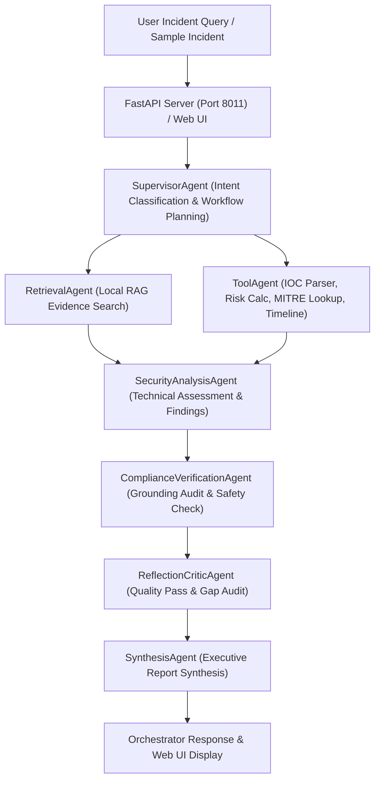

# Experiment 12 — Agentic Cybersecurity Research & Incident Decision Assistant (Capstone)

**Course Code:** MR23-1CS0436  
**Course Name:** Applied Agentic AI Laboratory  
**Module Type:** Capstone Project  
**Status:** ✅ Completed & Verified  
**Directory:** `experiment-12-capstone`  
**Port:** `8011`  

---

## 🎯 1. Experiment Number
**Experiment 12**

---

## 🛡️ 2. Experiment Title
**Agentic Cybersecurity Research & Incident Decision Assistant**

---

## 📚 3. Course Details
- **Course Code:** MR23-1CS0436
- **Course Name:** Applied Agentic AI Laboratory
- **Level:** Capstone Project

---

## 🎯 4. Aim
To design, build, test, and deploy an end-to-end, autonomous multi-agent cybersecurity decision assistant that integrates local Retrieval-Augmented Generation (RAG), safe tool execution, supervisor workflow planning, technical security analysis, evidence-grounding compliance verification, bounded reflection/critique, and executive report synthesis into a web application running on port `8011`.

---

## 📌 5. Learning Objectives
1. **Multi-Agent Orchestration:** Implement a supervisor-routed multi-agent architecture coordinating 7 specialist agents.
2. **Local RAG Evidence Retrieval:** Build a deterministic TF-IDF / Cosine Similarity vector search index over enterprise security playbooks.
3. **Safe Tool Integration:** Create deterministic tools for IOC parsing, risk calculation, MITRE ATT&CK lookup, and incident timeline generation.
4. **Safety & Grounding Compliance:** Enforce strict defensive safety filters and evidence-grounding checks (`SUPPORTED`, `PARTIALLY_SUPPORTED`, `INSUFFICIENT_EVIDENCE`).
5. **Bounded Reflection & Quality Audit:** Execute a bounded reflection pass (max 1 or 2 cycles) to detect missing evidence or technical contradictions.
6. **Executive Synthesis & Observability:** Synthesize structured executive incident reports and record full step-by-step agent execution traces.

---

## 📜 6. Problem Statement
Enterprise Security Operations Centers (SOCs) face thousands of security alerts daily. Security analysts struggle to manually triage alerts, parse complex indicators of compromise (IOCs), search internal playbooks, calculate risk, map MITRE ATT&CK techniques, and draft executive containment reports. Manual triage is slow and error-prone, while general-purpose LLMs without RAG or grounding verification risk producing hallucinated or unsafe counter-attack recommendations. **Experiment 12** addresses this by providing an autonomous, evidence-grounded, strictly defensive multi-agent assistant.

---

## 🌐 7. Capstone Overview
The application functions as a **Defensive Cybersecurity Research & Incident Decision Assistant**. Upon receiving a security query or raw incident alert (such as suspicious logins, spearphishing, web SQL injection probing, ransomware execution, or data exfiltration), the system plans an 8-stage execution workflow, executes specialist agents and safe tools, audits grounding and defensive safety compliance, and renders a web UI on port `8011`.

---

## 🧩 8. Concepts Integrated
- **Retrieval-Augmented Generation (RAG):** Deterministic local document chunking, indexing, and term-similarity ranking.
- **Supervisor Routing & Planning:** Intent classification and dynamic workflow plan generation.
- **Tool Use & Function Calling:** Safe, offline tools operating on structured data.
- **Evidence-Grounding Audit:** Strict verification of generated claims against retrieved knowledge base chunks.
- **Reflection / Critic Passes:** Bounded self-audit identifying technical gaps or missing evidence.
- **Observability & Traceability:** Structured step traces with step IDs, agent names, duration metrics, and execution statuses.

---

## 🏗️ 9. System Architecture



---

## 🤖 10. Agent Architecture
1. **`SupervisorAgent`:** Receives user query, classifies intent category (`Authentication Anomaly`, `Phishing / Email Security`, `Web Attack`, `Malware / Ransomware`, `Data Exfiltration`), and generates an 8-stage workflow plan.
2. **`RetrievalAgent`:** Queries the local RAG engine and ranks top $K$ evidence chunks.
3. **`ToolAgent`:** Invokes `IOCParserTool`, `RiskCalculatorTool`, `MITRELookupTool`, and `IncidentTimelineBuilderTool`.
4. **`SecurityAnalysisAgent`:** Analyzes retrieved evidence and tool outputs to generate structured technical findings.
5. **`ComplianceVerificationAgent`:** Audits findings for evidence grounding and verifies recommendations remain strictly defensive.
6. **`ReflectionCriticAgent`:** Conducts a bounded reflection audit (max 1–2 cycles) to identify gaps or contradictions.
7. **`SynthesisAgent`:** Compiles the final executive summary, technical assessment, defensive containment playbook, and verified sources.

---

## 📚 11. RAG Architecture
- **Knowledge Base Location:** `data/knowledge_base/`
- **Indexed Playbooks:**
  - `kb_01_authentication_attacks.md`
  - `kb_02_phishing_credential_harvesting.md`
  - `kb_03_web_attacks_sqli_xss.md`
  - `kb_04_malware_ransomware_containment.md`
  - `kb_05_data_exfiltration_monitoring.md`
  - `kb_06_incident_response_playbooks.md`
- **Indexing & Retrieval Method:** Paragraph header chunking ($300$ words, $50$ overlap), TF-IDF / term-frequency similarity scoring, header match boosting, and relevance ranking.

---

## 🛠️ 12. Safe Cybersecurity Tools
- **`KnowledgeSearchTool`:** Searches the local RAG index.
- **`IOCParserTool`:** Extracts IPv4 addresses, domain names, URLs, CVE identifiers, and file hashes via regex.
- **`RiskCalculatorTool`:** Computes risk score ($\text{Risk} = \text{Impact} \times \text{Likelihood} \times \text{AssetCriticality} \times \text{Confidence}$) and maps to severity (`LOW`, `MEDIUM`, `HIGH`, `CRITICAL`).
- **`MITRELookupTool`:** Maps incident categories to local MITRE ATT&CK techniques and defensive controls.
- **`IncidentTimelineBuilderTool`:** Constructs chronological event timelines from raw log lines.

---

## 🔄 13. Multi-Agent Workflow
1. User submits incident query or selects sample incident.
2. `SupervisorAgent` classifies intent and generates workflow plan.
3. `RetrievalAgent` retrieves ranked local RAG evidence chunks.
4. `ToolAgent` runs IOC parser, risk calculator, MITRE lookup, and timeline builder.
5. `SecurityAnalysisAgent` synthesizes technical findings.
6. `ComplianceVerificationAgent` audits evidence grounding and defensive safety rules.
7. `ReflectionCriticAgent` runs bounded reflection pass.
8. `SynthesisAgent` generates executive report.
9. Orchestrator records full trace ID and execution metrics.

---

## 📁 14. Directory Structure
```text
experiment-12-capstone/
├── app/
│   ├── agents/
│   │   ├── compliance_agent.py
│   │   ├── critic_agent.py
│   │   ├── retrieval_agent.py
│   │   ├── security_analyst.py
│   │   ├── supervisor.py
│   │   ├── synthesis_agent.py
│   │   └── tool_agent.py
│   ├── config.py
│   ├── main.py
│   ├── schemas.py
│   ├── services/
│   │   ├── orchestrator.py
│   │   ├── rag_engine.py
│   │   └── tools.py
│   └── static/
│       ├── app.js
│       ├── index.html
│       └── styles.css
├── data/
│   ├── knowledge_base/
│   │   ├── kb_01_authentication_attacks.md
│   │   ├── kb_02_phishing_credential_harvesting.md
│   │   ├── kb_03_web_attacks_sqli_xss.md
│   │   ├── kb_04_malware_ransomware_containment.md
│   │   ├── kb_05_data_exfiltration_monitoring.md
│   │   └── kb_06_incident_response_playbooks.md
│   ├── mitre_mapping.json
│   └── sample_incidents.json
├── screenshots/
│   ├── 01-capstone-home.png
│   ├── 02-supervisor-agent-plan.png
│   ├── 03-rag-evidence-retrieval.png
│   ├── 04-multi-agent-workflow.png
│   ├── 05-tool-execution-and-risk.png
│   ├── 06-compliance-reflection.png
│   ├── 07-final-incident-report.png
│   ├── 08-complete-command-center.png
│   └── README.md
├── tests/
│   ├── test_agents.py
│   ├── test_health.py
│   ├── test_orchestrator.py
│   ├── test_rag.py
│   └── test_tools.py
└── README.md
```

---

## 🌐 15. API Endpoints
- `GET /api/health`: Application health check.
- `GET /api/system`: System metadata and registered agents list.
- `GET /api/incidents`: Pre-curated sample incidents list.
- `GET /api/knowledge/stats`: Knowledge base indexing statistics.
- `POST /api/analyze`: Main multi-agent incident analysis orchestration.
- `POST /api/retrieve`: Direct RAG retrieval.
- `POST /api/tools/ioc`: Direct IOC parser tool execution.
- `POST /api/tools/risk`: Direct risk calculation.
- `GET /api/trace/{trace_id}`: Execution trace lookup.

---

## 🧪 16. Test Suite & Verification Results
```powershell
python -m pytest experiment-12-capstone/tests -v
# Output: 25 passed in 0.71s
```

All 25 unit and integration tests passed cleanly covering APIs, RAG retrieval, safe tools, individual agents, supervisor planning, reflection loop, compliance verification, and defensive safety enforcement.

---

## 📷 17. UI Screenshots & Hashes

| View | Screenshot Filename | SHA-256 Hash | Byte Size |
| :--- | :--- | :--- | :--- |
| **01. Initial Home Interface** | `screenshots/01-capstone-home.png` | `8D2517622E75AABB70E833CE5E8B652CAF5C60D1845099374CE410377CE5077A` | 199,324 B |
| **02. Supervisor Workflow Plan** | `screenshots/02-supervisor-agent-plan.png` | `6D3297075621EA80AD1D3ECDF1E97834457B972BDED1285D89A78860F99427A2` | 247,920 B |
| **03. RAG Evidence Retrieval** | `screenshots/03-rag-evidence-retrieval.png` | `B65CEC686EA751280CBB9C7BE113911BE9DD012A0FB7AF18154F33C84E082A5D` | 47,441 B |
| **04. Multi-Agent Workflow Pipeline** | `screenshots/04-multi-agent-workflow.png` | `1CE264588951BD8125CD596E8A430FB39FDE28101DCEABC31403EB5ECD5852F7` | 236,874 B |
| **05. Safe Tool Executions & Logs** | `screenshots/05-tool-execution-and-risk.png` | `62EC191164297D59F0D23F8F4F0B8E57E5B313C2A617CB214DE4592D14F55758` | 214,047 B |
| **06. Compliance & Quality Audit** | `screenshots/06-compliance-reflection.png` | `84E06168BA76ED38D8CD747C51E4AFF0EC9D967E8156B40A8BCFA0B683E24BAC` | 206,063 B |
| **07. Executive Incident Report** | `screenshots/07-final-incident-report.png` | `D903DD6DBA9BD6DF663ED943237B85EB418697C4E3D50F5F3AB24284DD8BFF34` | 232,229 B |
| **08. Command Center Metrics** | `screenshots/08-complete-command-center.png` | `DB814635AA838B8E5C3093110D065B4AEB082E04EA8B512CD93495B2959F6732` | 207,633 B |

---

## ❓ 18. Viva Voce Q&A Preparation

1. **Q: What is the primary objective of Experiment 12?**
   *A:* To build an autonomous multi-agent cybersecurity decision assistant integrating RAG, tool use, supervisor workflow routing, compliance verification, and executive synthesis into a web app on port 8011.
2. **Q: What specialist agents make up the multi-agent system?**
   *A:* 7 agents: SupervisorAgent, RetrievalAgent, ToolAgent, SecurityAnalysisAgent, ComplianceVerificationAgent, ReflectionCriticAgent, SynthesisAgent.
3. **Q: What safe tools are integrated into the system?**
   *A:* KnowledgeSearchTool, IOCParserTool, RiskCalculatorTool, MITRELookupTool, IncidentTimelineBuilderTool.
4. **Q: How does the system enforce evidence grounding and defensive safety?**
   *A:* The ComplianceVerificationAgent audits recommendations to ensure zero offensive counter-attacks exist and checks claims against retrieved RAG chunks, assigning status `SUPPORTED`, `PARTIALLY_SUPPORTED`, or `INSUFFICIENT_EVIDENCE`.
5. **Q: What default port is reserved for Experiment 12?**
   *A:* Port `8011`.
6. **Q: How many automated tests cover Experiment 12?**
   *A:* 25 automated PyTest unit and integration tests.
