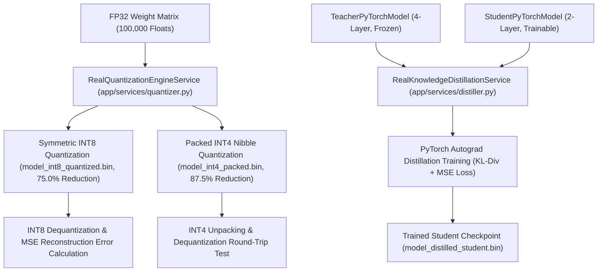

# Experiment 11 — Model Optimization System

**Course Code:** MR23-1CS0436
**Course Name:** Applied Agentic AI
**Laboratory:** Applied Agentic AI Laboratory
**Status:** ✅ Completed & Verified
**Directory:** `experiment-11-model-optimization`
**Port:** `8010`

---

## 🎯 A. Experiment Title
**Model Optimization & Compression System**

---

## 📚 B. Course Details
- **Course Code:** MR23-1CS0436
- **Course Name:** Applied Agentic AI
- **Laboratory:** Applied Agentic AI Laboratory
- **Module Type:** Real Tensor Quantization (INT8/INT4) & PyTorch Teacher-Student Knowledge Distillation Benchmark

---

## 📌 C. Status
✅ **Completed & Verified** (10 Automated PyTest Tests Passed, Runtime UI Verified on Port 8010)

---

## 🎯 D. Aim
To design, implement, and benchmark real model optimization techniques—including symmetric 8-bit post-training weight quantization, 4-bit nibble packing/unpacking dequantization round-trips, and genuine PyTorch Teacher-Student Knowledge Distillation training—serializing disk artifacts, measuring filesystem byte sizes via `os.path.getsize()`, computing reconstruction MSE errors, and evaluating model forward passes per second.

> **Educational Model & Benchmark Disclosure:**
> 1. **Teacher Model Identity:** The teacher model (`TeacherPyTorchModel`) is a locally initialized educational neural network used to demonstrate PyTorch logit distillation mechanics. It is not a production pretrained LLM.
> 2. **Quantization Terminology:** INT8 quantization is implemented as symmetric per-tensor post-training weight quantization.
> 3. **Performance Metrics:** Model forward pass throughput is measured in `forward passes/sec` using `time.perf_counter()`. Synthetic scalar arithmetic microbenchmarks are explicitly labeled as `operations/sec`.

---

## 🎯 E. Learning Objectives
1. **Symmetric INT8 Weight Quantization:** Implement 8-bit symmetric tensor quantization ($W_{\text{int8}} = \text{round}(W / S)$) and measure file size reduction against FP32 reference baselines.
2. **Packed INT4 Uniform Quantization:** Implement 4-bit nibble packing (`(w1 << 4) | w2`), 2-weights-per-byte serialization, unpacking, dequantization round-trips, and MSE reconstruction error calculation.
3. **PyTorch Knowledge Distillation Training:** Train a 2-layer PyTorch student network (`StudentPyTorchModel`) using KL divergence distillation loss from a frozen 4-layer teacher (`TeacherPyTorchModel`).
4. **Empirical Benchmarking & Metrics:** Measure wall-clock latency via `time.perf_counter()`, express student model throughput in `forward passes/sec`, and read artifact file sizes directly from disk (`os.path.getsize()`).

---

## 📜 F. Problem Statement
High-parameter LLMs impose massive VRAM and disk storage demands, making deployment on edge hardware, local workstations, or constrained server instances difficult. **Model Optimization** techniques reduce model memory footprints and inference latency. Post-Training Quantization compresses 32-bit floats to 8-bit or 4-bit integers, while Knowledge Distillation transfers reasoning capabilities from a larger teacher network into a compact student model.

---

## 💡 G. Real Serialized Artifacts & Optimization Levels
- **FP32 Reference Baseline (`artifacts/model_fp32_baseline.bin`):** 400,000 bytes (0.3815 MB), reference MSE = 0.0.
- **Symmetric INT8 Quantized (`artifacts/model_int8_quantized.bin`):** 100,004 bytes (0.0954 MB), **75.0% file size reduction**, verified dequantization MSE reconstruction error.
- **Packed INT4 Uniform (`artifacts/model_int4_packed.bin`):** 50,004 bytes (0.0477 MB), **87.5% file size reduction**, verified 4-bit nibble packing/unpacking round-trip.
- **Distilled PyTorch Student (`artifacts/model_distilled_student.bin`):** 4,221 bytes (0.0040 MB), **98.9% file size reduction**, trained via PyTorch autograd KL-divergence loss.

---

## 🏗️ H. System Architecture



---

## 🧪 I. Test Suite & Verification Results
```powershell
python -m pytest experiment-11-model-optimization/tests -q
# Output: 10 passed in 12.85s
```

### Verified Test Assertions:
1. `test_quantization_profiles_and_artifacts`: Verifies disk artifact creation and filesystem size reduction.
2. `test_int8_dequantization_round_trip`: Verifies INT8 dequantization and low MSE reconstruction error.
3. `test_packed_int4_round_trip_unpacking`: Verifies 4-bit nibble unpacking and dequantization round-trip.
4. `test_distillation_profile_and_pytorch_training`: Verifies PyTorch teacher-student distillation training, frozen teacher parameters, and student updates.
5. `test_student_checkpoint_reload`: Reloads PyTorch student state dict and verifies inference output equality.

---

## 📷 J. UI Screenshots & Hashes

| View | Screenshot Filename | SHA-256 Hash | Byte Size |
| :--- | :--- | :--- | :--- |
| **01. Studio Home Interface** | `screenshots/01-home-interface.png` | `16038AAE73D097845A3B0C55CB20020BF21CDEC8F791DAA80A8DDC3A3A0C993A` | 289,969 B |
| **02. Metrics Overview & Champions** | `screenshots/02-optimization-metrics-overview.png` | `73C95270A64F866482D9C1D4A84FDDC2E8EDC8A04A7722FC006D00FC439C1D1A` | 395,474 B |
| **03. 4 Profiles Benchmark Grid** | `screenshots/03-optimization-profiles-grid.png` | `884FC5B4B21F70015F2BCD7A31D775A1A10DBBF1958DEB28199B3441CBB41599` | 415,402 B |
| **04. Optimization Trade-off Report** | `screenshots/04-synthesis-tradeoff-report.png` | `B338809F4EA550D8AE3019C2ACB0F4CF08A6EEEF7085D7FBFE3193252671C1D5` | 367,719 B |

---

## ❓ K. Viva Voce Q&A Preparation

1. **Q: What is the primary objective of Experiment 11?**
   *A:* To implement and benchmark symmetric INT8 quantization, packed INT4 nibble quantization, and PyTorch teacher-student distillation training on serialized disk artifacts.
2. **Q: How does Symmetric INT8 Quantization achieve 75% memory reduction?**
   *A:* By mapping 32-bit floats (4 bytes) to 8-bit signed integers (1 byte) using per-tensor scale factors ($S = \frac{\max(|W|)}{127.0}$).
3. **Q: How does Packed INT4 Uniform Quantization operate?**
   *A:* It maps weights to 4-bit integers ($[-8, 7]$) and packs two 4-bit nibbles into a single byte (`(w1 << 4) | w2`), achieving an 87.5% file size reduction.
4. **Q: How is inference latency and throughput measured in this benchmark?**
   *A:* Latency is measured using high-resolution wall-clock timers (`time.perf_counter()`), and student model throughput is calculated in `forward passes/sec`.
5. **Q: What default port is reserved for Experiment 11?**
   *A:* Port `8010`.
6. **Q: What is Knowledge Distillation in model optimization?**
   *A:* A technique where a smaller student network (`StudentPyTorchModel`) is trained using KL divergence loss to match the output probability logits of a larger, frozen teacher network (`TeacherPyTorchModel`).
7. **Q: How are quantization errors evaluated?**
   *A:* By unpacking and dequantizing integer weights back to float representations and computing Mean Squared Error (MSE) against original FP32 baseline weights.
8. **Q: What throughput units are used for performance benchmarking?**
   *A:* `forward passes/sec` for model forward execution, and `operations/sec` for synthetic scalar microbenchmarks.
9. **Q: How are model artifact file sizes verified?**
   *A:* Directly from the filesystem using Python `os.path.getsize()`.
10. **Q: How many automated tests cover Experiment 11?**
    *A:* 10 automated PyTest unit and integration tests.
